# Section 10 **Introduction Basic Programming**

## Resume

Dalam section 10 mempelajari:

<ul>
    <li>Tools</li>
    <li>Basic Programming</li>
    <li>Data Type</li>
    <li>Array</li>
    <li>Utilities Programs Commands</li>
    <li>File Access Permissions</li>
</ul>

### Tools

> Terdiri dari JDK dan IDE

JDK Melakukan developing, debugging, monitoring
 IDE dapat menggunakan BlueJ, Neatbeans, Eclips, Intelij IDEA

 

### Basic Programming

1. Type Data
2. Branching
3. Looping
4. Input Output
5. Operator

 

### Data type

1. Integer
2. Float
3. Double
4. Boolean
5. Char
6. String

 

### Array

> [Indeks1,Indeks2,Indeks3,Indeks4,Indeks5...dst]

 

### Operator

<li> Assignment ( = )
<li> Arithmetic ( +, -, *, / , %)
<li> Unary ( + , -, ++, --, ! )
<li> Equality dan Relational ( ==, != , > , >=, <,<= )
<li> Conditional ( &&, || )

 

### Input Output

> Input -> Jva Program -> Output

 

### Branching

- If then
- If Then Else
- Switch

 

### Looping

- For
- While
- DoWhile

  

# Task

 

## Problem1

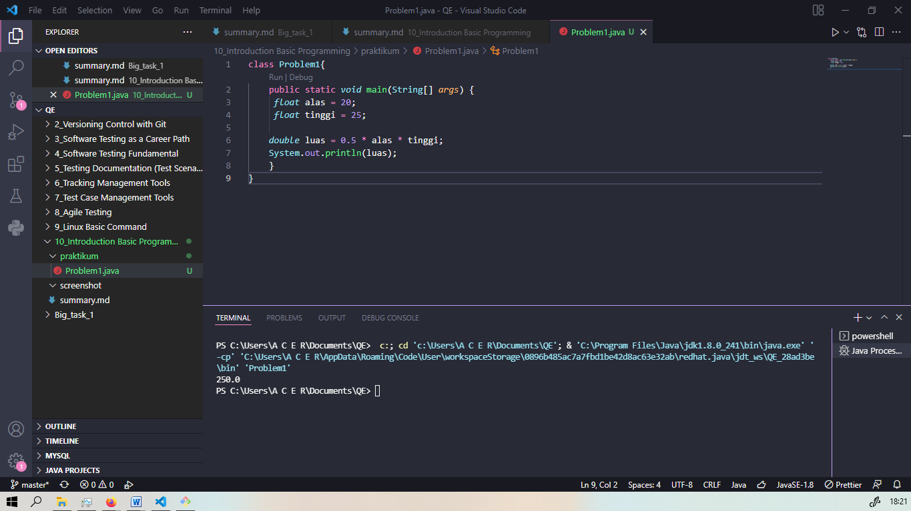

## Problem2

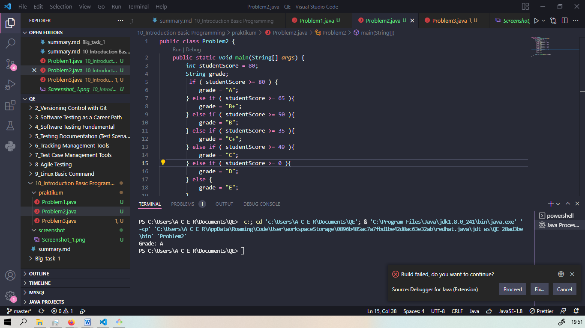

## Problem3

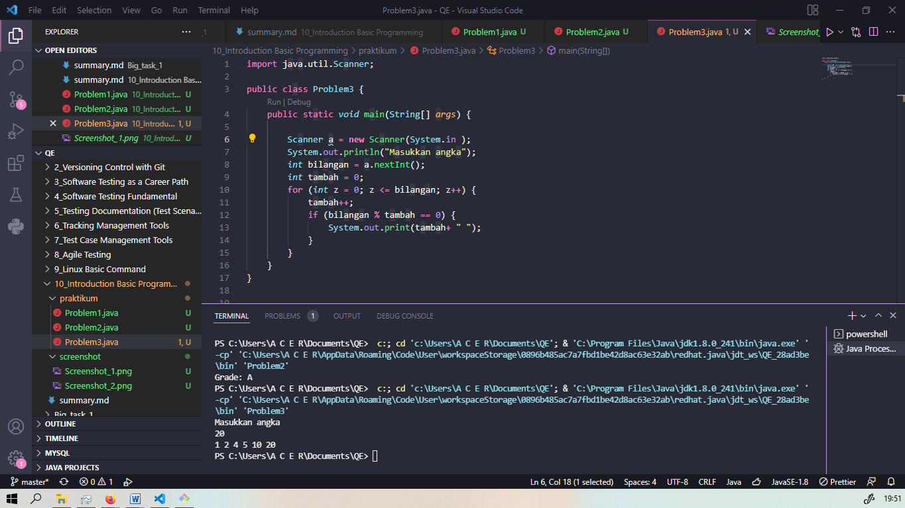

## Problem4

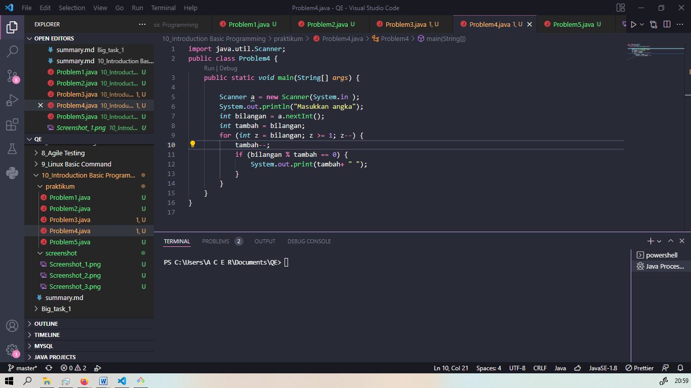

## Problem5

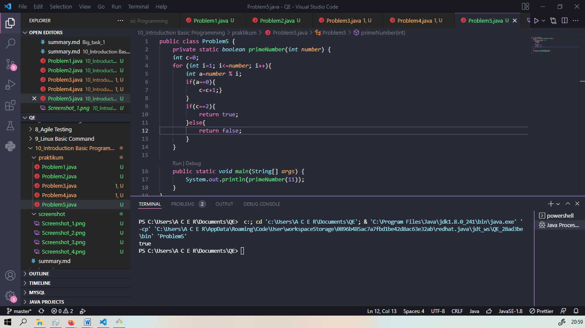

## Problem6

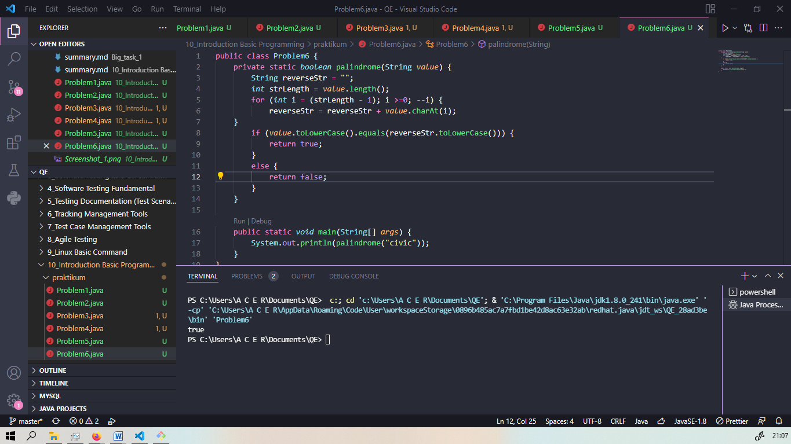

## Problem7

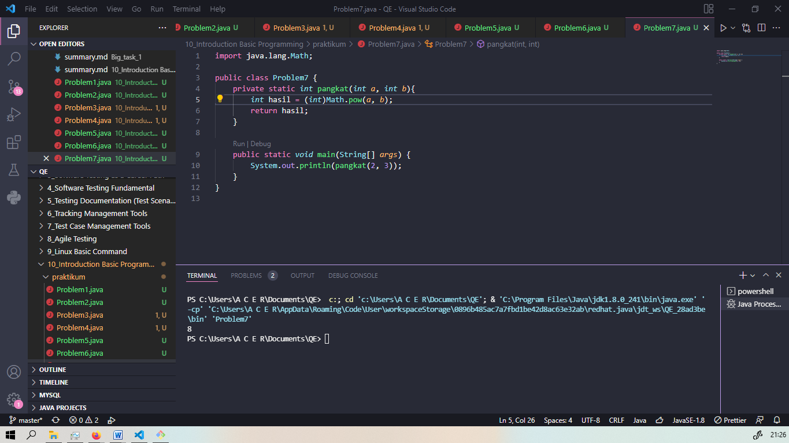

## Problem8

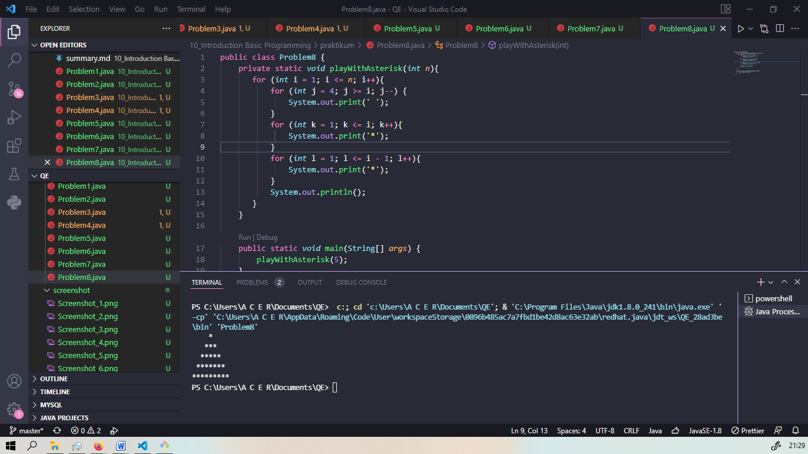

## Problem9

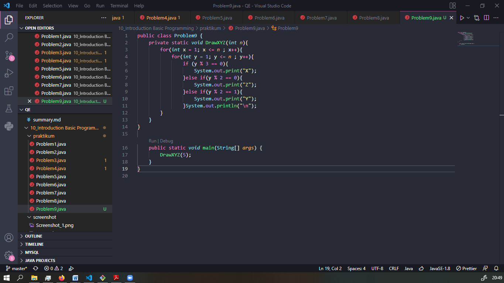

## Problem10

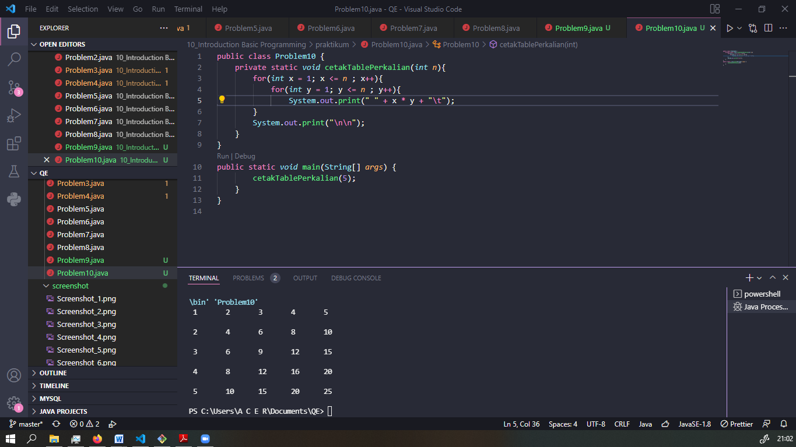

## Problem11

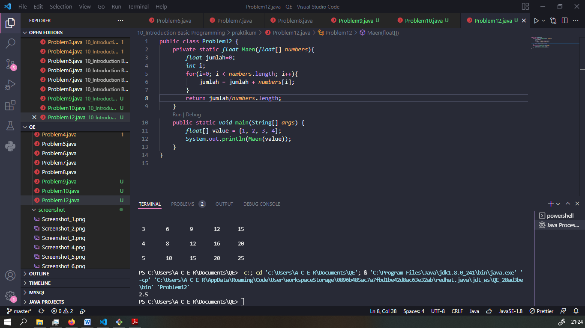
