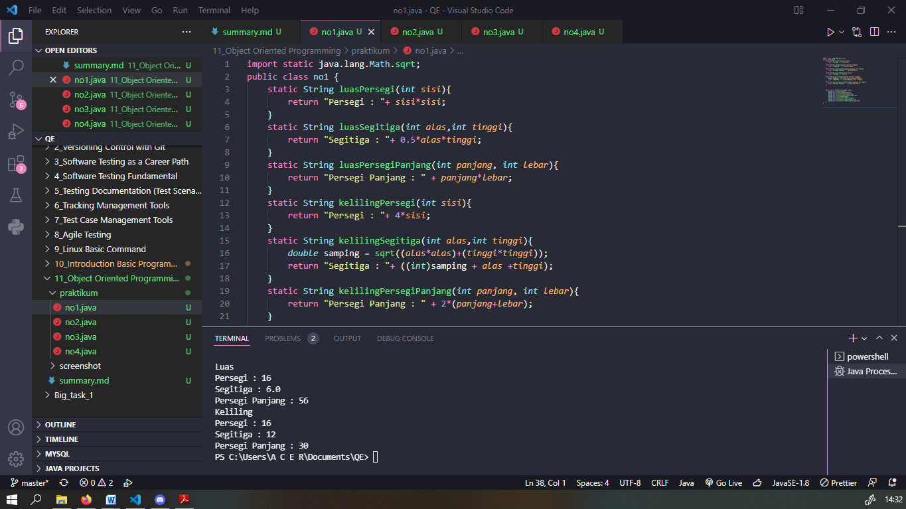
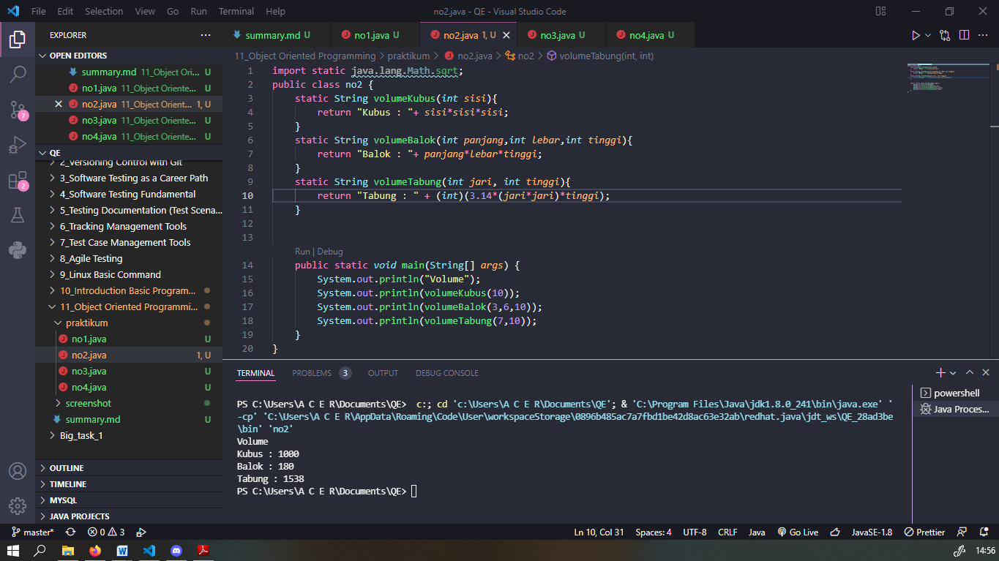
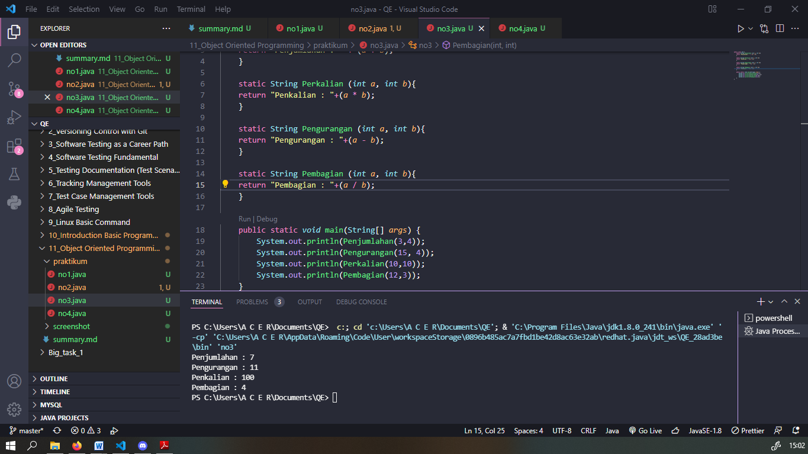
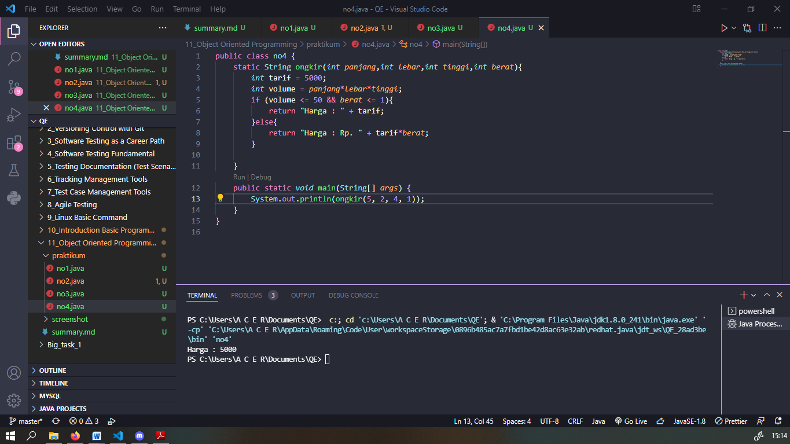
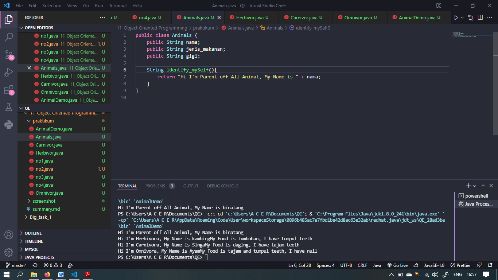
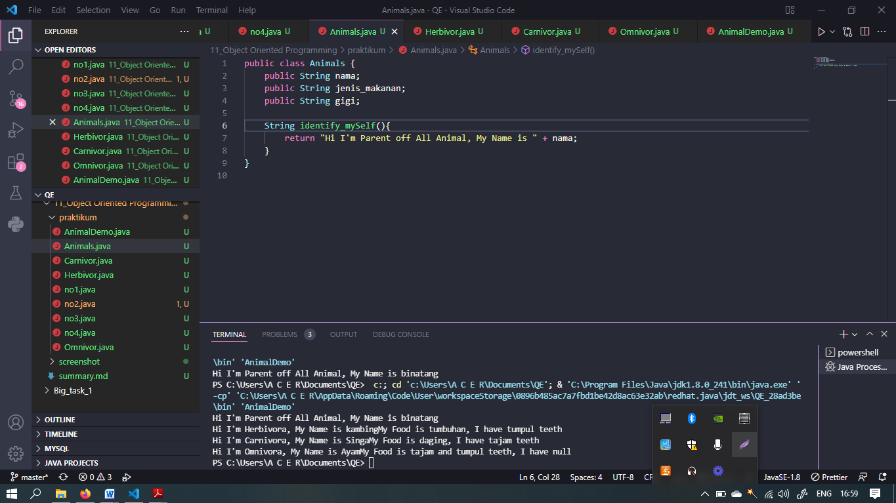
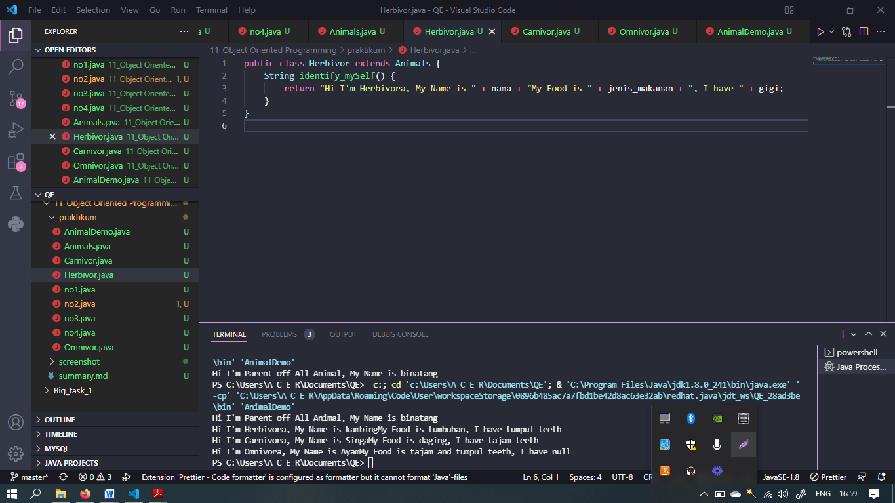
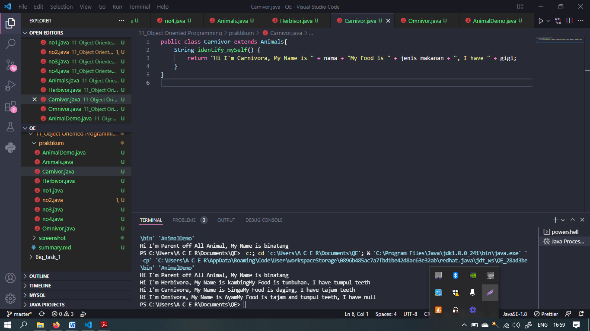
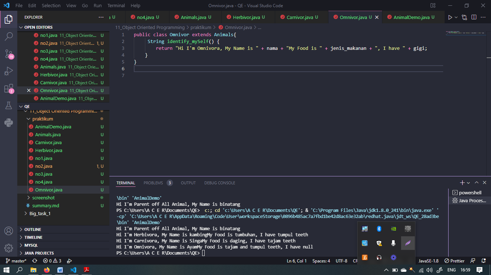
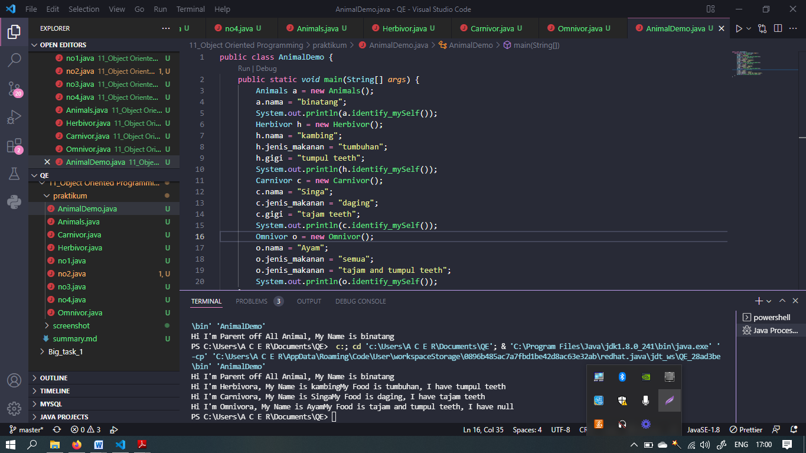

# Section 11 Object Oriented Programming

### Mempelajari:

- Object
- Inheritance
- Atributte
- Method
- Class

### Object

> Access Modifier ( Public, Default, Private, Protected) , Variabel

### Class

> Parent -> Child1, Child2, dst

### Inheritance

> Override dan Overloading

# Task

### Problem 1

### Problem 2

### Problem 3

### Problem 4

### Problem 5

