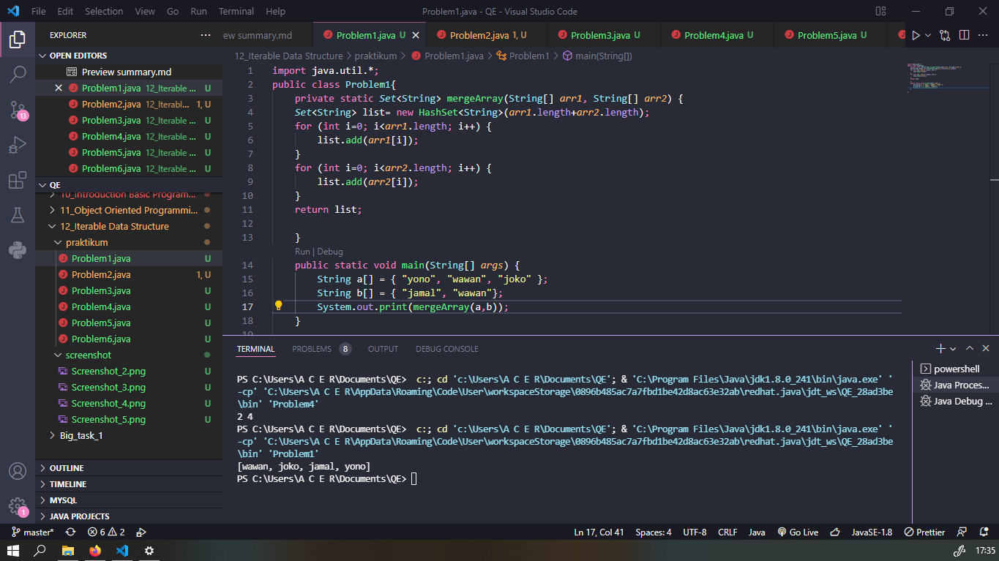
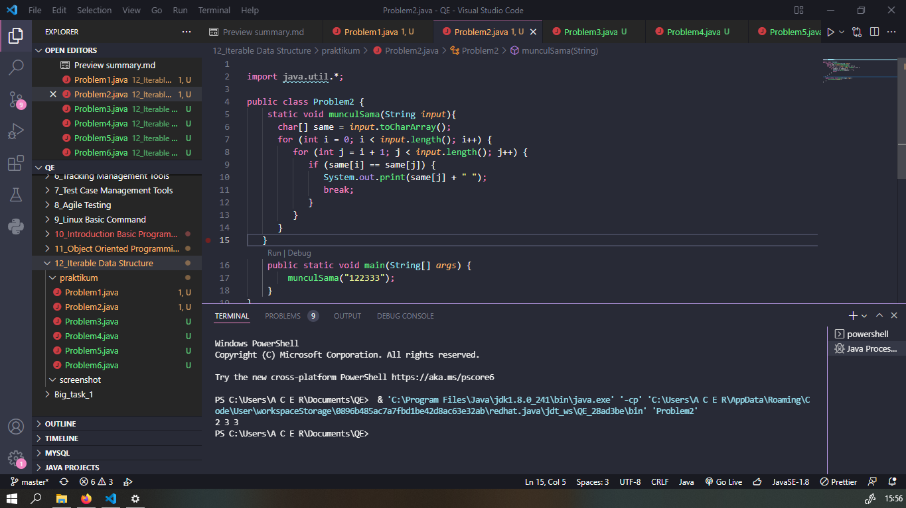
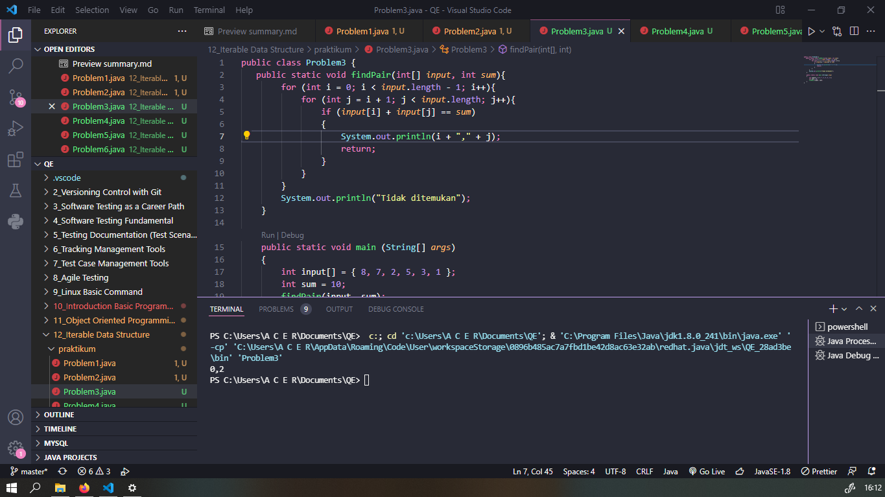
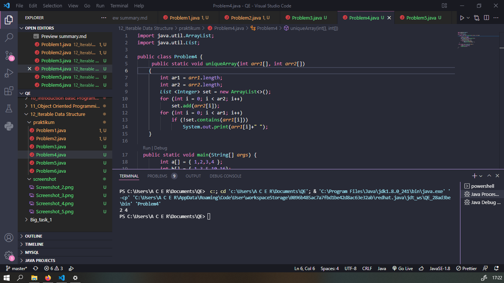
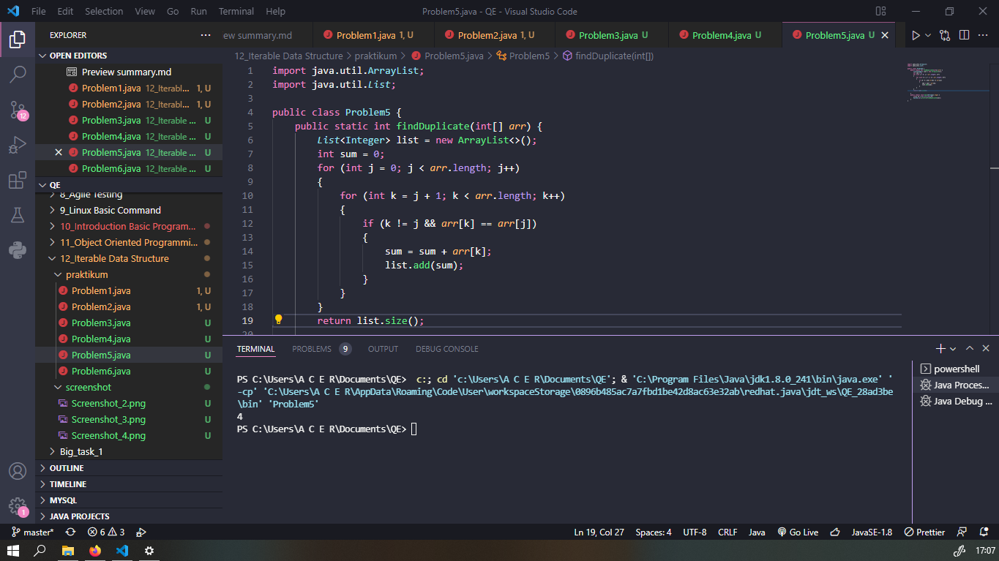

# Section 12 Iterable Data Structure

### Mempelajari:

- Java iterable hierachy
- General Purpose Implementations

## Java iterable hierachy

> Iterable

- forEach
- iterator
- splitetator
  > Iterator

> Collections

> List

> ArrayList

> Linkedlist

> Set

## General Purpose Implementations

> Interface : Set , List, Deque

> Hash table : HashSet -> Set

> Resizeable array : ArrayList -> List , ArrayDeque -> Deque

> Tree : TreeSet -> Set

> LinkedList : LinkedList -> List, Deque

 

# TASK

### Problem 1

### Problem 2

### Problem 3

### Problem 4

### Problem 5

