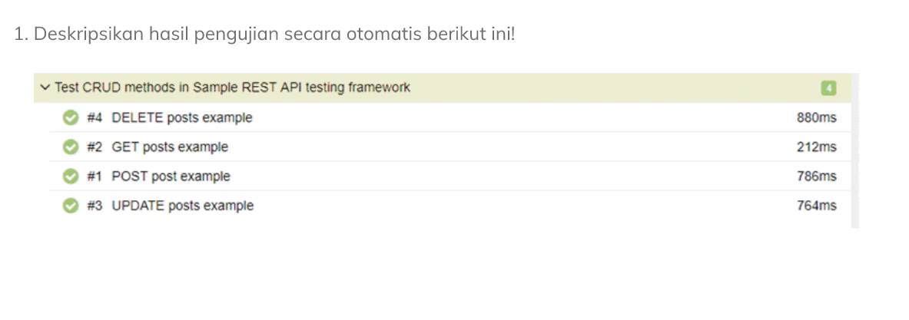
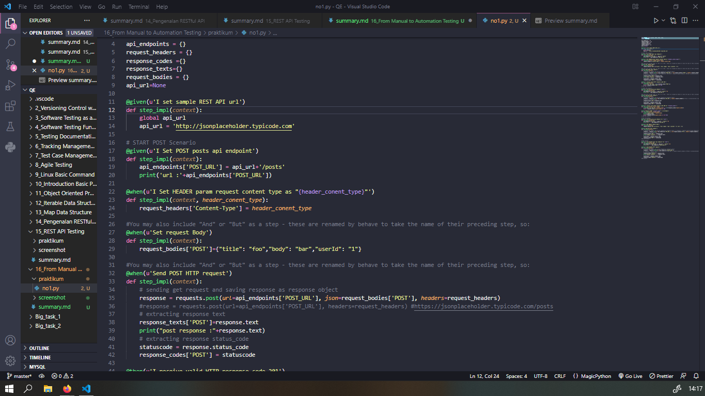
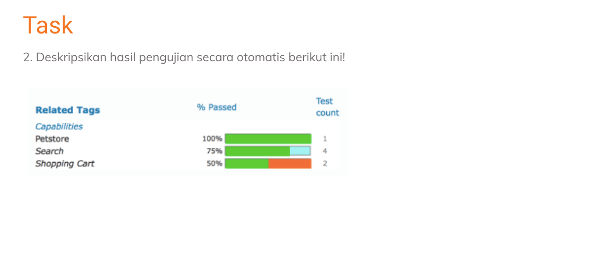

# Section 16 From Manual to Automation Testing

## Manual Testing

adalah langkah untuk mencari cacat atau bug pada program perangkat lunak. Tester atau penguji memposisikan sebagai user. Tester melakukan testing secara manual tanpa bantuan software atau tools

## Kelebihan dan Kekurangan Manual Testing

Kelebihan :

- Mendapatkan visual feedback
- Tidak perlu menggunakan tools sehingga biaya lebih rendah
- Bisa mendapatkan feedback secara langsung sehingga tau user yang suka atau tidak suka

Kekurangan :

- Kurangnya ketelitian atau masih terdapat error
- Membuat kelelahan dan kesalahan karena seringnya melakukan manual test karena tidak terecord dengan baik

## Automation Testing

adalah langkah untuk mencari bug oleh tester menggunakan automation tools atau software untuk mengeksekusi testcase

## Kelebihan dan Kekurangan Automation Testing

Kelebihan :

- Dapat menenmukan bug lebih banyak serta script yang error daripada melakukan manual testing
- Efisien waktu dalam menemukan bug atau cacat serta script yang error
- Tes yang dapat dilakukan berulang

Kekurangan :

- Lebih mahal tapi menghemat waktu dan tenaga
- Kurangnya human element / interaksi user
- Tidak adanya feedback UI

## Why Automation testing?

- Flexibility
- Velocity
- Coverage
- Error-Avoidance

## Which test case to automate ?

- Test case yang dapat dilakukan berulang kali
- Test case yang sulit dilakukan secara manual
- Test case yang membutuhkan waktu lama jika dikerjakan manual

# Automate Testing Process

1. Test tool Selection
2. Define Scope of Automation
3. Planning, design, and development
4. Test Execution
5. Maintenance

   

# Task

# No 1

Feature: Test CRUD methods in Sample REST API testing framework

Scenario: POST post example
Given I Set POST posts api endpoint
When I Set HEADER param request content type as "application/json."
And Set request Body
And Send a POST HTTP request
Then I receive valid HTTP response code 201
And Response BODY "POST" is non-empty.

Scenario: GET posts example
Given I Set GET posts api endpoint "1"
When I Set HEADER param request content type as "application/json."
And Send GET HTTP request
Then I receive valid HTTP response code 200 for "GET."
And Response BODY "GET" is non-empty

Scenario: UPDATE posts example
Given I Set PUT posts api endpoint for "1"
When I Set Update request Body
And Send PUT HTTP request
Then I receive valid HTTP response code 200 for "PUT."
And Response BODY "PUT" is non-empty

Scenario: DELETE posts example
Given I Set DELETE posts api endpoint for "1"
When I Send DELETE HTTP request
Then I receive valid HTTP response code 200 for "DELETE."

Screeshot :

Kesimpulan berdasarkan test report scenario result:

Method POST, GET, UPDATE, DELETE ketika di test sudah sukses response code 200 dengan ditandai status 4 hijau

# No 2

Berdasarkan gambar diatas :

- testing Petstore sudah passed 100% dengan artian berhasil dilakukan testing seluruhnya dan berhasil dengan testing count 1
- testing Search memiliki nilai passed 75% dengan artian berhasil dilakukan testing sebanyak 75% dan berhasil dengan testing count 4
- testing Shopping Cart nilai passed 50% dengan artian berhasil dilakukan testing sebagian 50% dengan testing count 2
