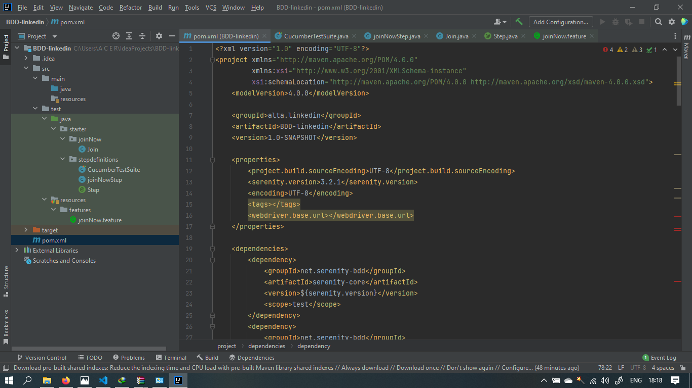
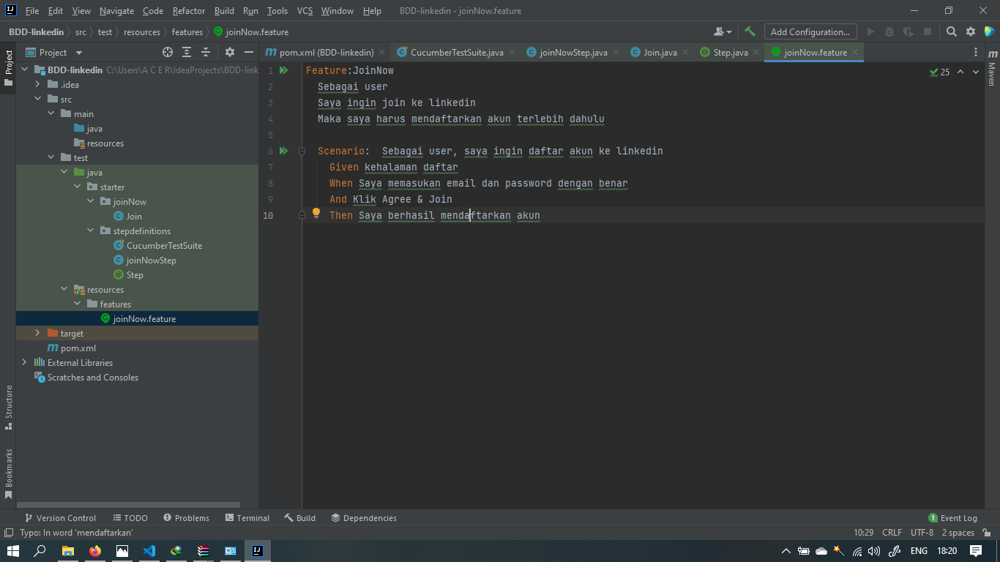
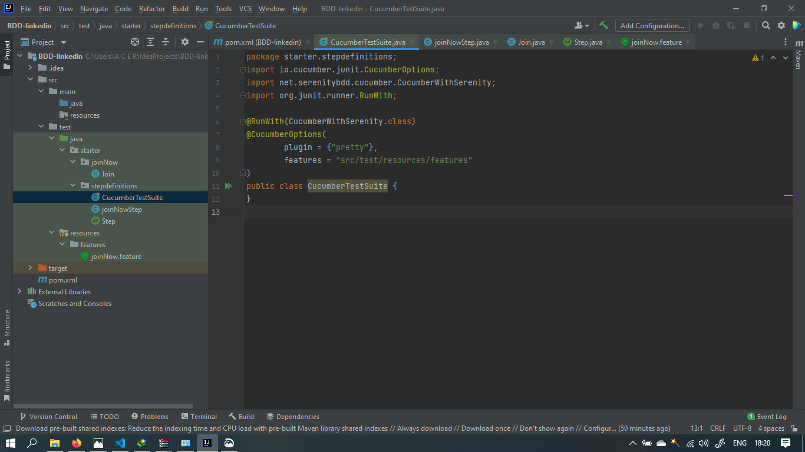
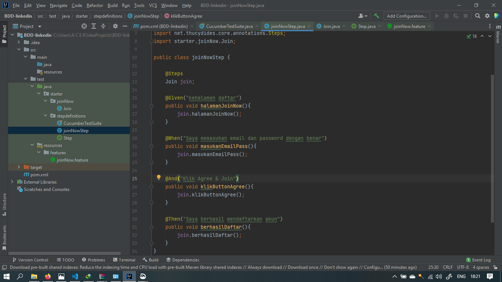
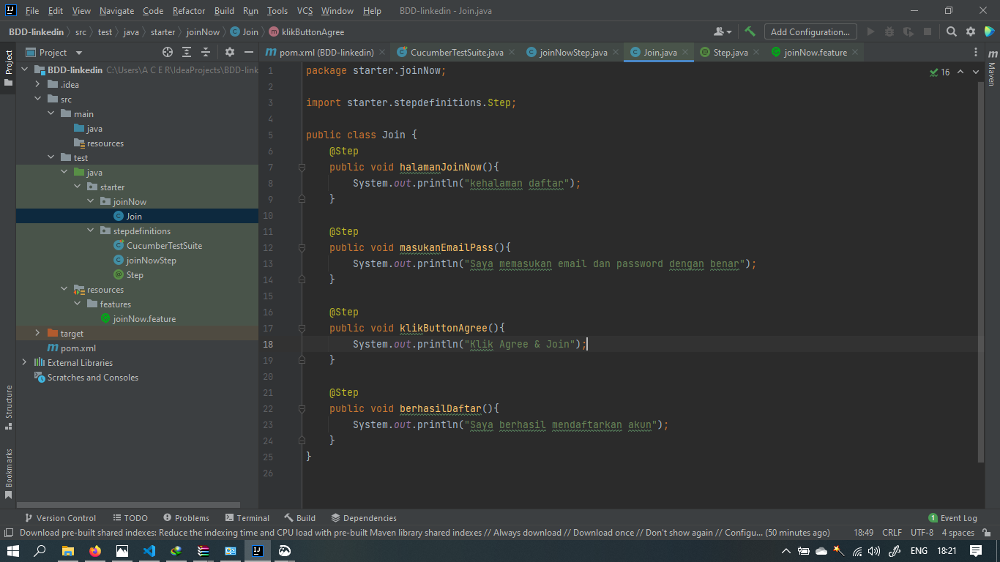

# Section 17 Behaviour Driven Development

Pada materi ini mempelajari :

- Apa itu BDD ?
- Apa itu Cucumber ?

## BDD ( Behaviour Driven Development )

Proses software development yang menerapkan penulisan test case sebelum developer menuliskan production source code.
 
BDD berfokus pada komponen sistem dan test case ditulis dalam bahasa pemograman
 
Dalam BDD test, tim developer akan menuliskan berbagai skenario yang menjelaskan behaviour sistem dari perspektif pengguna. Skenario dituliskan dengan bahasa yang mudah dipahami oleh seluruh stakeholder
 
BDD bertujuan untuk meningkatkan proses komunikasi dan kolaborasi antar seluruh stake holder yang terlibat dalam pengembangan sistem dari segi bisnis maupun teknikal dengan tujuan agar seluruh fitur fitur dalam sistem dapat dipahami oleh seluruh anggota tim.
 
Prinsip dasar dari BDD adalah mendeskripsikan behavior dari sebuah sistem tanpa melibatkan penjelasan implementasinya secara rinci. Terdapat pemisahan antara keduanya. Dalam pendekatan BDD, seluruh stakeholders (technical & non-technical) saling berkolaborasi untuk mendeskripsikan kebutuhan pengguna dan kebutuhan fungsional (behavior) sistem, yang dituliskan melalui feature files. Deskripsi yang ada dalam feature files berperan sebagai test logic, yang kemudian akan menjadi dasar bagi Quality Assurance (QA) dalam menuliskan test script untuk implementasi pengujian, dan dasar bagi developer dalam menuliskan implementation code untuk membangun sistem.
 
Feature files pada BDD dituliskan menggunakan bahasa Gherkin, dengan format berbahasa Inggris yang mudah dipahami oleh siapa pun — terlepas dari technical knowledge yang dimiliki. Dengan demikian, non-technical stakeholders dapat tetap memahami test logic tanpa perlu memahami implementasi menggunakan kode pemrograman yang lebih kompleks. Begitu pula sebaliknya, technical stakeholders atau developer dapat turut memahami aspek bisnis dari sistem yang mereka implementasikan.
 
Secara mendasar terdapat tiga tahapan untuk melakukan test dalam BDD:

- Tahap 1 — Menentukan user stories; untuk menjelaskan kebutuhan pengguna dan fungsionalitas sistem yang diharapkan
- Tahap 2 — Menuliskan skenario (dalam feature files, menggunakan Gherkin) berdasarkan user stories
- Tahap 3 — Mengimplementasikan test script (dalam step files) berdasarkan skenario

 
Simple Example

User story memiliki format standar:

> “As a <role>, I want to <need/goal>, so that <why>.”

Dalam menjelaskan kebutuhan pengguna untuk log in dalam suatu akun, user story yang terbentuk adalah:

> “As an existing user, I want to log into my account, so that I can see my home page.”

Selanjutnya, user story dituliskan dalam skenario. Sebuah feature file terdiri dari satu atau lebih skenario yang menjelaskan apa yang seharusnya dilakukan oleh sistem dalam situasi tertentu. Terdapat 3 keyword sebagai elemen utama dalam skenario BDD:

- Given — menjelaskan konteks dari skenario
- When — menjelaskan tindakan yang dilakukan oleh user
- Then — menjelaskan outcome dari tindakan yang dilakukan oleh user
   
  Kita juga dapat menggunakan keyword lainnya seperti And, But, Background, Scenario Outline, dan Examples. Silakan baca referensi berikut untuk memahami penggunaan berbagai keyword dalam bahasa Gherkin.
   
  Berikut adalah contoh sederhana dari penulisan skenario menggunakan bahasa Gherkin untuk log in dalam suatu akun

> Feature: Log in
> Scenario: Logging in as an existing user
> Given I go to my application's log in page
> When I fill in correct username and password
> And I click Log In
> Then I see my home page

## Cucumber

Untuk melakukan serangkaian behaviour test, ada sebuah tool yang disebut Cucumber. Cucumber adalah sebuah tool yang mendukung BDD.
 
Cucumber membaca semacam ketentuan yang dapat dieksekusi, dimana ditulis menggunakan teks biasa dan ketentuan tersebut memvalidasi bahwa sistem atau aplikasi melakukan apa yang dituliskan dalam ketentuan tersebut. Ketentuan tersebut terdiri dari beberapa skenario.

 
 

# TASK

