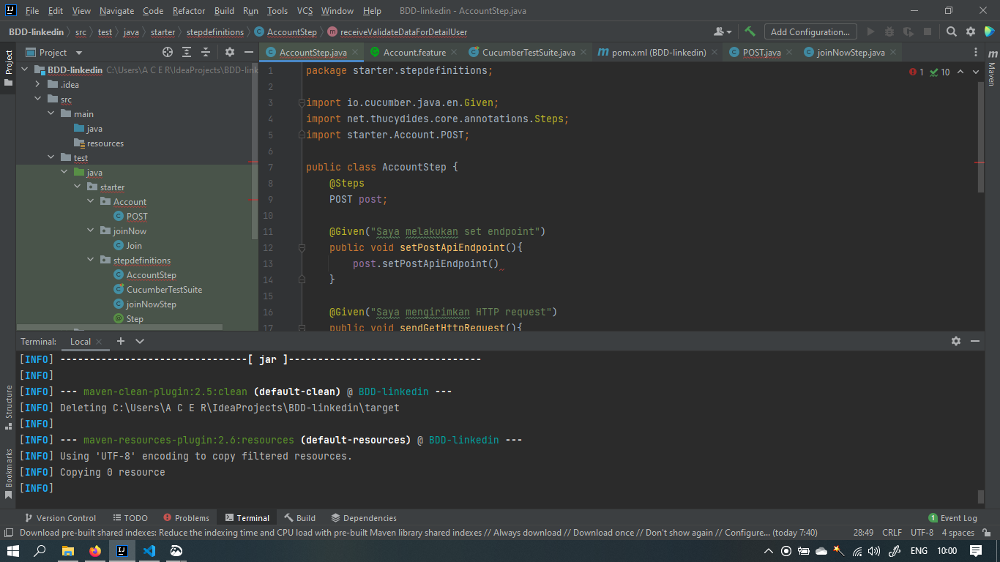
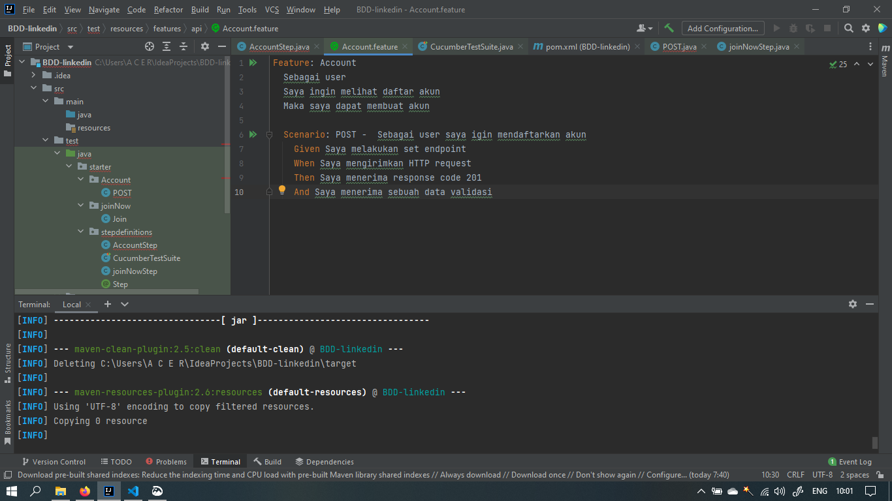
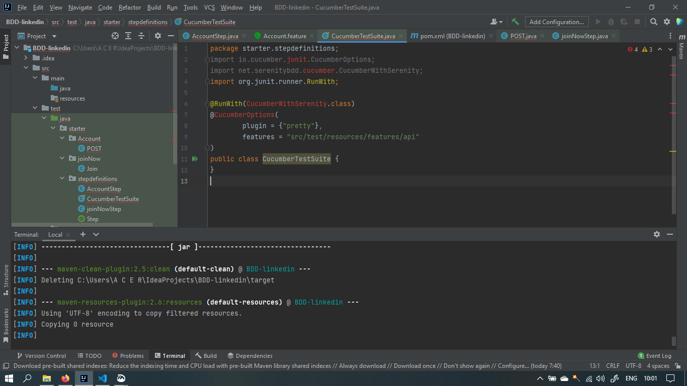
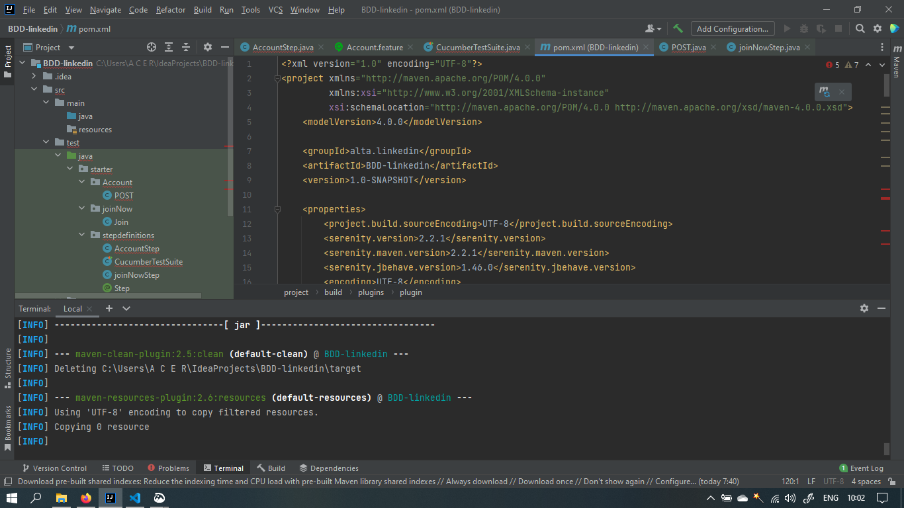
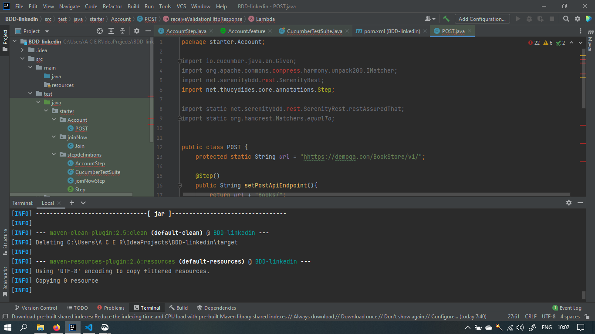
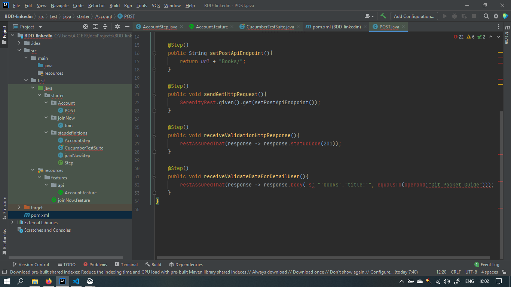

# Section 18 RESTful API Testing with Rest Assured

Pada materi ini mempelajari :

- REST API Concept
- Fundamental API Integration
- BDD With Cucumber
- REST ASSURED

## API Concept

API mempunyai konsep:
 

- Client (request) -> Waiter - API (request) -> Chef - System/Server (request)
   
- Chef - System/Server (response) -> Waiter - API (response) -> Client (response)
   

## Fundamental API Integration

> Mobile App -> API Server -> EXT Process -> API Testing

Test Process :

- Record, Define API Information
- Parsing, Filter or Recording API Data and then extract
- Reconstruction API calls, and sent them from a simulate client
- Test Validation

## BDD With Cucumber

1. Write Story
2. Map Steps to Java
3. Configure Stories
4. Run Stories
5. View Reports

## REST ASSURED

- Supports for HTTP Method
- Support for BDD / Gherkin ( Given, When, Then)
- Use of Hamcrest matches for checks
- User of Gpath for selecting element from JSON response

# TASK

# BANG INI ERROR MERAH MERAH KENAPA YA PUSING EUY

