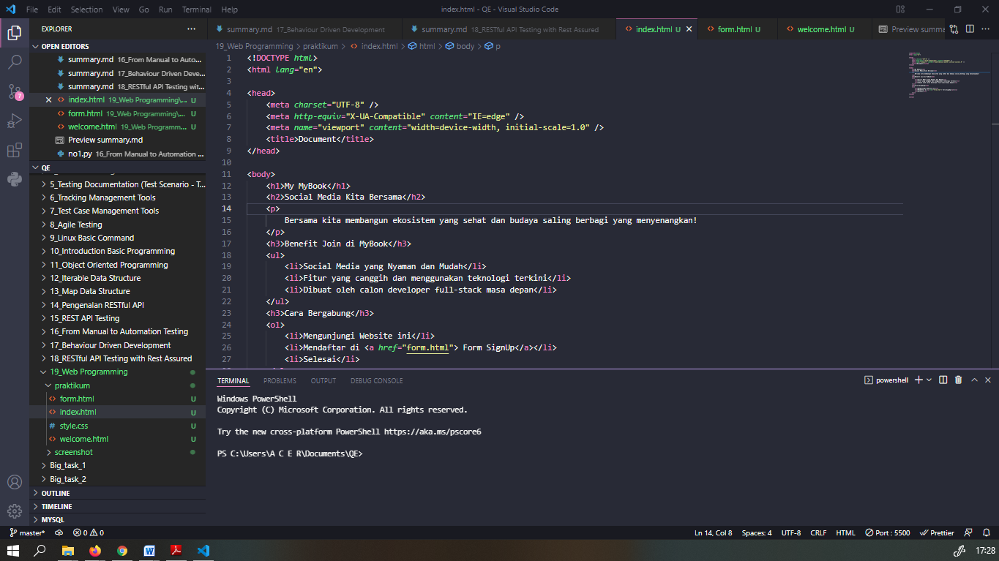

# Section 19 Web Programming

Pada materi ini mempelajari :

- PART I ( HTML, HTML Editor, Dokumentasi HTML, Struktur HTML,Tag, Styling, List, CSS, Table, Form)
- PART II ( CSS, Syntax CSS, CSS Selector, CSS Grouping, CSS Font, CSS Properties, CSS Margin dan Padding, CSS Background, CSS Link, CSS Transisi, CSS Display, CSS Tabel )
- PART III ( Bootstrap, Class Pada Bootstrap, Container, Grid , Component)

## HTML

Hypertext Markup Language atau HTML adalah markup untuk membuat halaman website.
 
HTML terdiri dari kombinasi teks dan simbol yang disimpan dalam sebuah file. Dalam membuat file HTML, terdapat standar atau format khusus yang harus diikuti. Format tersebut telah tertuang dalam standar kode internasional atau ASCII (American Standard Code for Information Interchange).

## HTML Editor

1. Notepad++
2. Sublime Text.
3. VS Code
4. Atom

## Dokumentasi HTML

1. < html >
2. < head >
3. < title >
4. < body >

## Struktur HTML

- Tag, digunakan sebagai awalan instruksi atau perintah yang akan dibaca web browser. Misalnya: tag < bold >. Tag ini akan meminta browser menampilkan teks dalam format tebal;
- Element, merupakan keseluruhan kode yang terdiri dari tag pembuka (<>) hingga tag penutup (</ >). Contohnya: <‘h1> Contoh Elemen < /h1’ >. Meski demikian, tidak semua tag HTML memiliki pasangan penutup;
- Attribute, yaitu informasi atau perintah tambahan yang berada di dalam elemen. Misalnya: < img src=”pantai.jpg” alt=”Pantai Baron.” > Elemen ini menggunakan tag < img > dengan atribut sumber gambar (src) dan alt text (alt).

## CSS

CSS adalah kepanjangaan dari Cascading Style Sheets yang berguna untuk menyederhanakan proses pembuatan website dengan mengatur elemen yang tertulis di bahasa markup.
 
CSS dipakai untuk mendesain halaman depan atau tampilan website (front end). CSS menangani tampilan dan ‘rasa’ dari halaman website.

## Bootstrap

Bootstrap adalah kerangka kerja CSS yang sumber terbuka dan bebas untuk merancang situs web dan aplikasi web. Kerangka kerja ini berisi templat desain berbasis HTML dan CSS untuk tipografi, formulir, tombol, navigasi, dan komponen antarmuka lainnya, serta juga ekstensi opsional JavaScript. Tidak seperti kebanyakan kerangka kerja web lainnya, kerangka kerja ini hanya fokus pada pengembangan front-end saja.

# TASK

