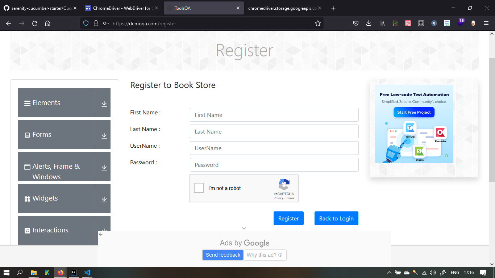
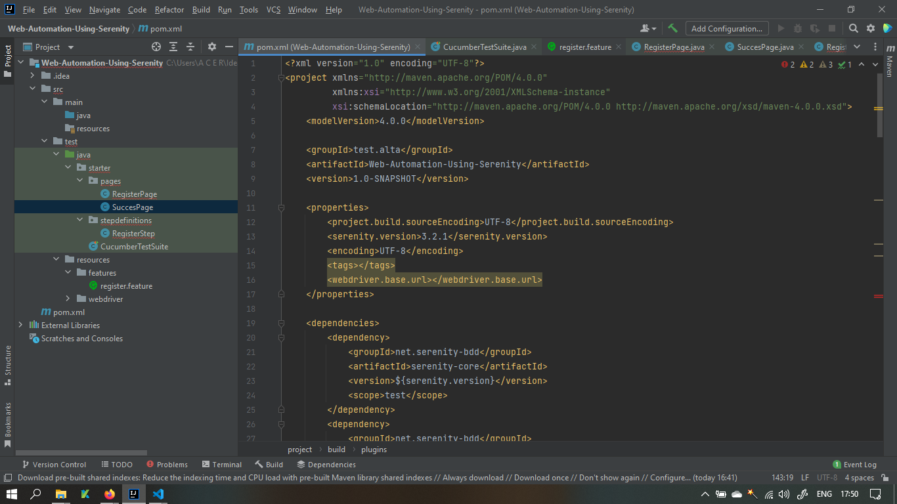
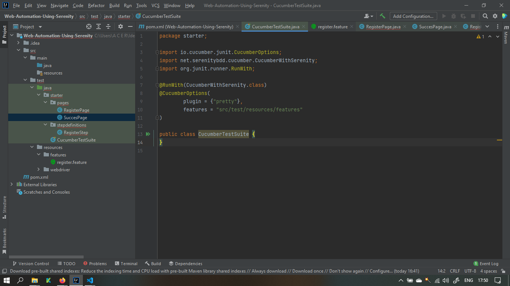
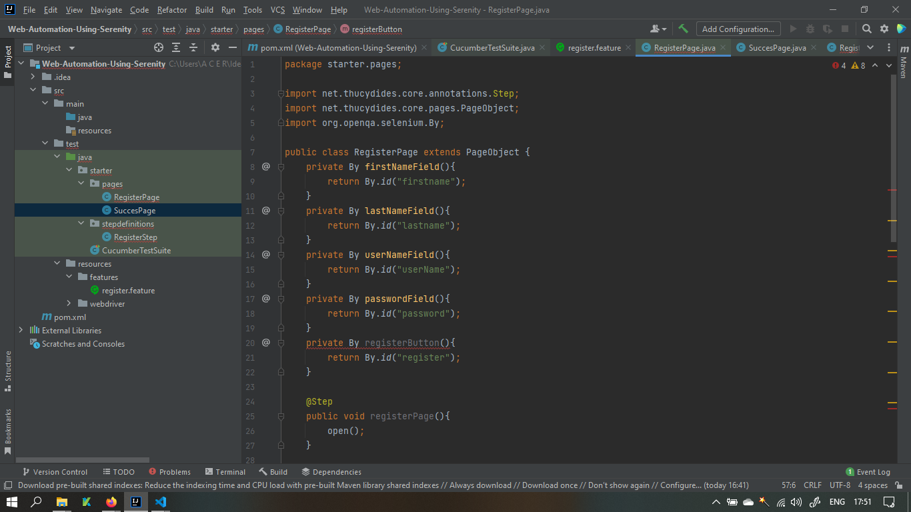
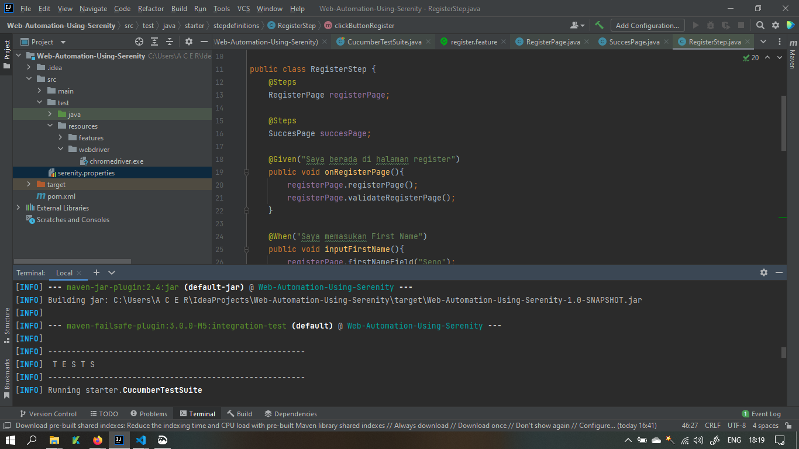
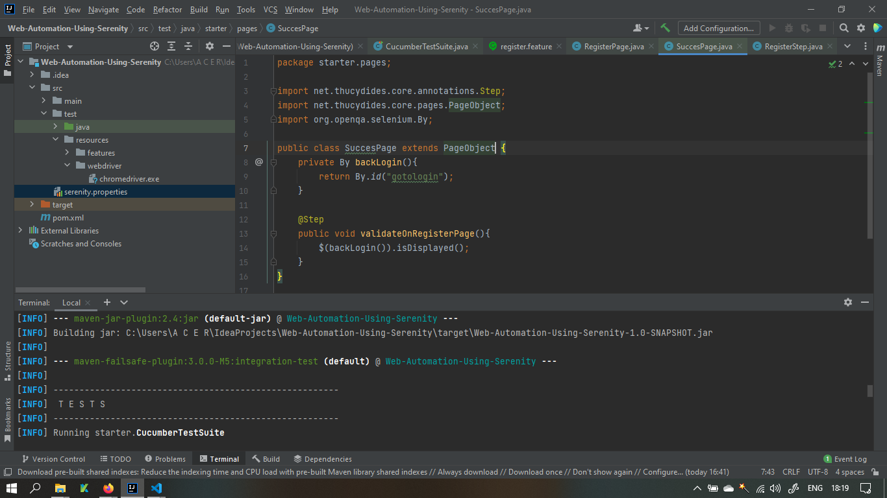

# Section 20 Review Web UI Testing with Serenity

Pada materi ini mempelajari :

1. Introduction Serenitiy BDD
2. BDD Framework With Cucumber
3. Practice Scenario
4. Digging Deeper

## Introduction Serenitiy BDD

Serenity BDD adalah perpustakaan open source yang bertujuan untuk mewujudkan ide dokumentasi hidup.

Serenity BDD membantu menulis automated acceptance dan regression tests yang lebih bersih dan lebih mudah dipelihara dengan lebih cepat. Serenity juga menggunakan hasil pengujian untuk menghasilkan laporan naratif bergambar yang mendokumentasikan dan menjelaskan apa yang dilakukan aplikasi Anda dan cara kerjanya. Serenity memberi tahu tidak hanya tes apa yang telah dijalankan, tetapi yang lebih penting, persyaratan apa yang telah diuji.

## Define your requirements and acceptance criteria

Saat menggunakan Serenity, mulai dengan persyaratan yang perlu diterapkan. Ini sering dinyatakan sebagai cerita pengguna dengan kriteria penerimaan yang membantu memperjelas persyaratan. Kriteria Penerimaan inilah yang kami otomatisasi dengan Serenity.

## Automate your acceptance criteria

Selanjutnya, menjelaskan kriteria penerimaan dalam istilah bisnis tingkat tinggi. Pengembang mencatat kriteria penerimaan ini menggunakan alat BDD seperti Cucumber atau JBehave, atau hanya di Java menggunakan JUnit, sehingga Serenity dapat menjalankannya.

## Implement the tests

Pengembang sekarang menerapkan kriteria penerimaan, sehingga mereka dapat berjalan melawan aplikasi yang sebenarnya. Di bawah kerangka , pengujian dipecah menjadi langkah-langkah bersarang untuk keterbacaan yang lebih baik dan perawatan yang lebih mudah. Jika Anda menguji aplikasi web, Serenity menyediakan dukungan bawaan yang bagus untuk pustaka Selenium 2/WebDriver open source yang populer.

 
# TASK

