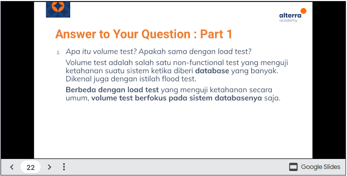
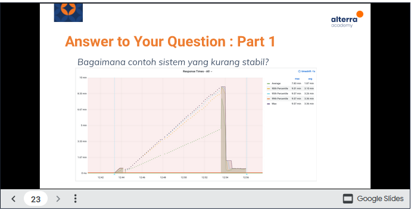

# Section 21 Review Web UI Testing with Serenity

Pada materi ini mempelajari :

1. Performance Test
2. Introduction to JMeter
3. Post Processor
4. Understanding JMeter Result

## Apa Itu Performance Test?

Teknik non functional testing untuk menentukan parameter
sistem dalam hal responsif dan stabilitas dibawah berbagai
beban (load) kerja

Performance testing mengukur kualitas atribut dari sistem
seperti stabilitas, ketahanan (reliability) dan penggunaan
sumber daya.

## Apa Yang Diukur Dari Performance Test?

- Performa suatu aplikasi sampai suatu batas tertentu.
- Bukan merupakan functional-test
- Bisa dalam berbagai macam bentuk untuk memahami reliability, stability dan availability pada environment-nya
    contoh:
- Mengamati response time ketika menjalankan request dalam jumlah yang sangat banyak
- Melihat suatu sistem berinteraksi dengan jumlah data
  yang cukup besar.

## Mengapa Performance Test Jarang Dilakukan?

Pada umumnya performance testing cukup mahal untuk
diaplikasikan dan dijalankan, namun dapat dijadikan tolak ukur
apakah sistem tersebut dapat mengakomodasi traffic yang ada

Hal ini disebabkan karena pengetesannya ~memerlukan
persiapan yang dimana beberapa kasus harus membuat
environment terpisah dari production agar tidak tercampurnya
data test dengan data production.

Environment ini ada juga yang membuatnya di server cloud yang
biayanya bisa lebih besar dari environment production.

## Apa Yang Perlu Diperhatikan Dari Performance Test?

Dalam melakukan performance test biasanya yang menjadi
perhatian adalah throughput dan response data-nya.

## Contoh Kasus Performance Test

Sebuah sistem baru yang akan di launch ke production, namun
sebelum masuk ke production perlu dilakukan performance
test untuk mengetahui throughput dan response time dari
sistem tersebut.

Untuk informasi endpoint yang akan di test adalah

1. login
2. /beli-pulsa
3. /cek-out

## Langkah yang harus dilakukan:

1. Membuat test plan

2. Membuat script test

3. Melakukan performance test

4. Menganalisa hasil performance test

## Membuat Test Plan

Kenali yang dibutuhkan :
-Endpoint yang akan ditest

1. /Login
2. /beli_pulsa
3. /Cek_out

-Kebutuhan masing - masing endpoint
1.Username dan password untuk endpoint /login
2.Produk, denom dan nomor untuk tesan untuk endpoint /beli_pulsa
3.Metode pembayaran yang dipilih untuk endpoint /cek_out

## Smoke Testing

Dilakukan untuk verify script yang sudah dibuat, apakah
sistem tersebut dapat handle minimal load, tanpa masalah
sama sekali, Biasanya hanya 1-2 VUs

## Stress Testing

Stress testing merupakan pengujian perangkat lunak yang dilakukan untuk memverifikasi stabilitas & keandalan sistem. Fungsi utama Pengujian ini yaitu untuk mengukur sistem pada ketahanan dan kemampuan penanganan kesalahannya dalam kondisi beban yang sangat berat sehingga dapat dipastikan sistem tidak akan crash di bawah situasi krisis.

## Integration Testing

Integration testing merupakan pengujian perangkat lunak di mana masing-masing unit (yang berinteraksi di dalam sebuah software) digabungkan dan diuji untuk memverifikasi apakah mereka berfungsi sebagaimana mestinya ketika terintegrasi. Tujuan utama di sini adalah untuk menguji antarmuka antar modul.

## Regression Testing

Regression testing merupakan jenis pengujian perangkat lunak untuk mengkonfirmasi bahwa perubahan program atau kode baru yang ditambahkan tidak mempengaruhi fitur yang ada.

# Task

Untuk mengukur bagaimana sistem yang kurang stabil diperlukan :

> Stress testing merupakan pengujian perangkat lunak yang dilakukan untuk memverifikasi stabilitas & keandalan sistem. Fungsi utama Pengujian ini yaitu untuk mengukur sistem pada ketahanan dan kemampuan penanganan kesalahannya dalam kondisi beban yang sangat berat sehingga dapat dipastikan sistem tidak akan crash di bawah situasi krisis.

> Performance test adalah pengujian yang dilakukan untuk memeriksa kecepatan, waktu respons, keandalan, penggunaan sumber daya, skabilitas program perangkat lunak dibawah beban kerja yang diharapkan. Tujuan pengujian ini bukan untuk menemukan bug akan tetapi untuk menghilangkan hambatan kinerja.

Fokus performance testing adalah memeriksa program perangkat lunak yang diantaranya yaitu :

1. Kecepatan : Menentukan apakah aplikasi merespons dengan cepat.
2. Skabilitas : Menentukan beban pengguna meksimal yang dapat ditangani oleh aplikasi perangkat lunak.
3. Stabilitas : Menentukan apakah aplikasi stabil dibawah beban yang bervariasi.
