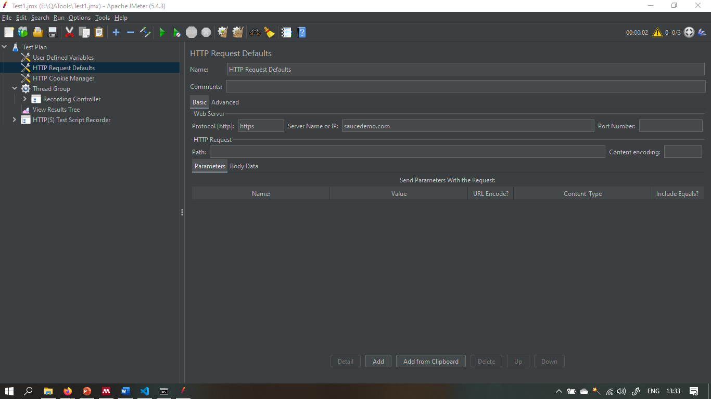
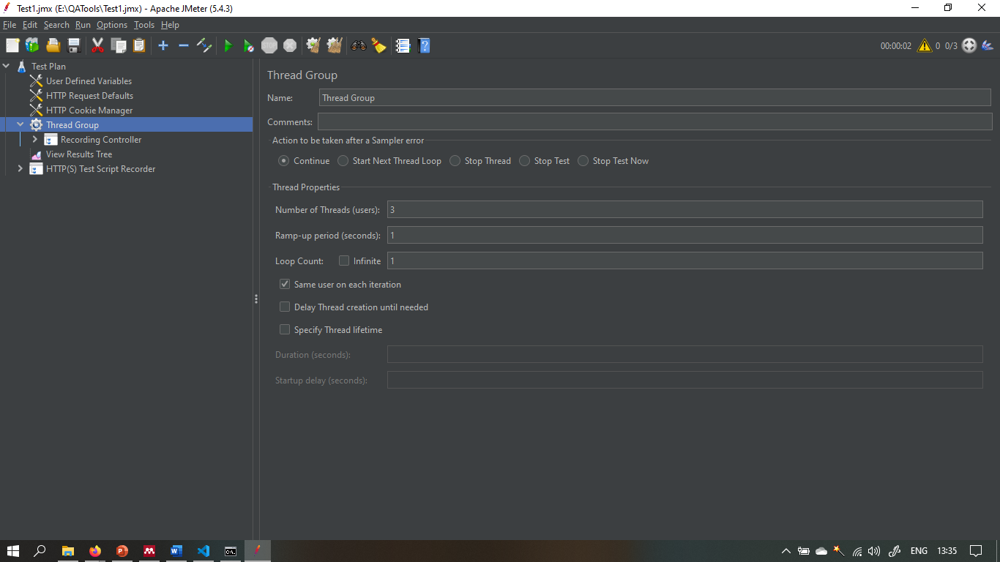
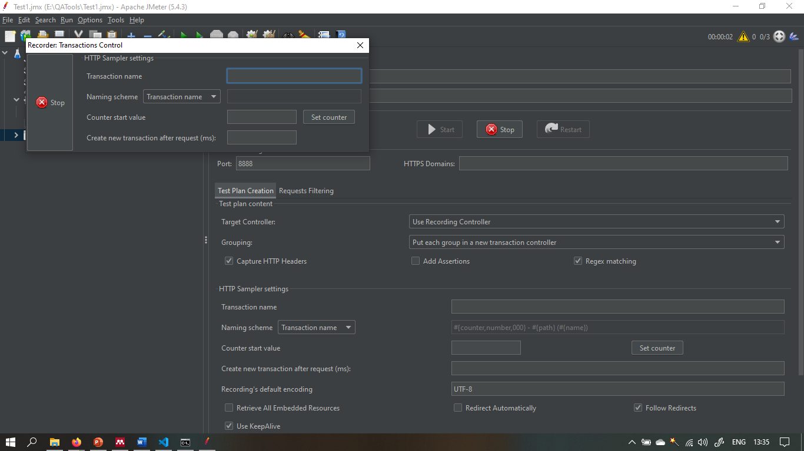
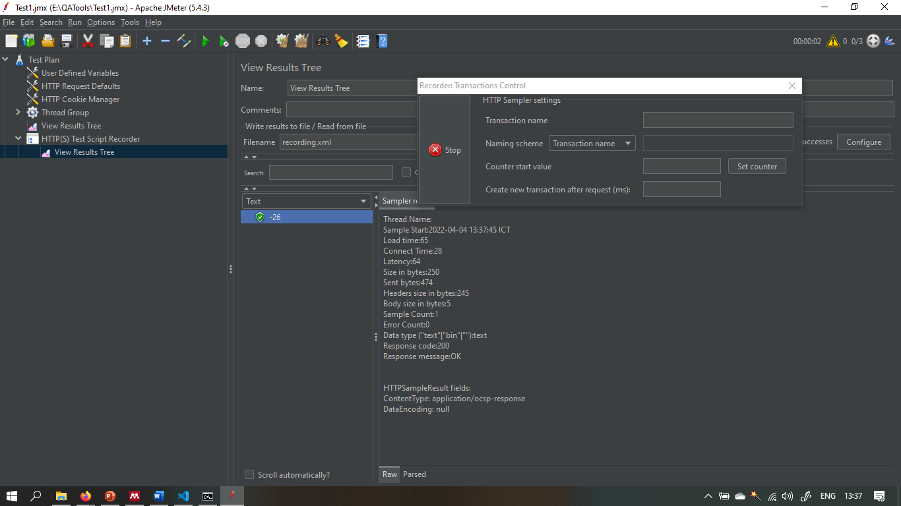
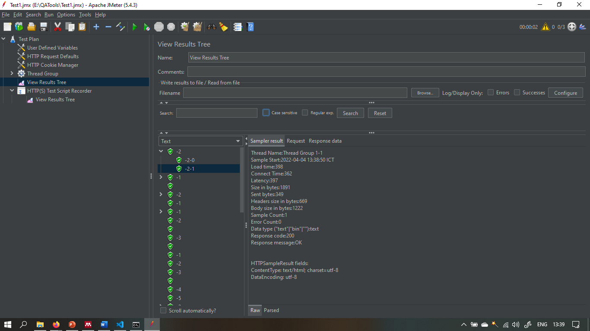
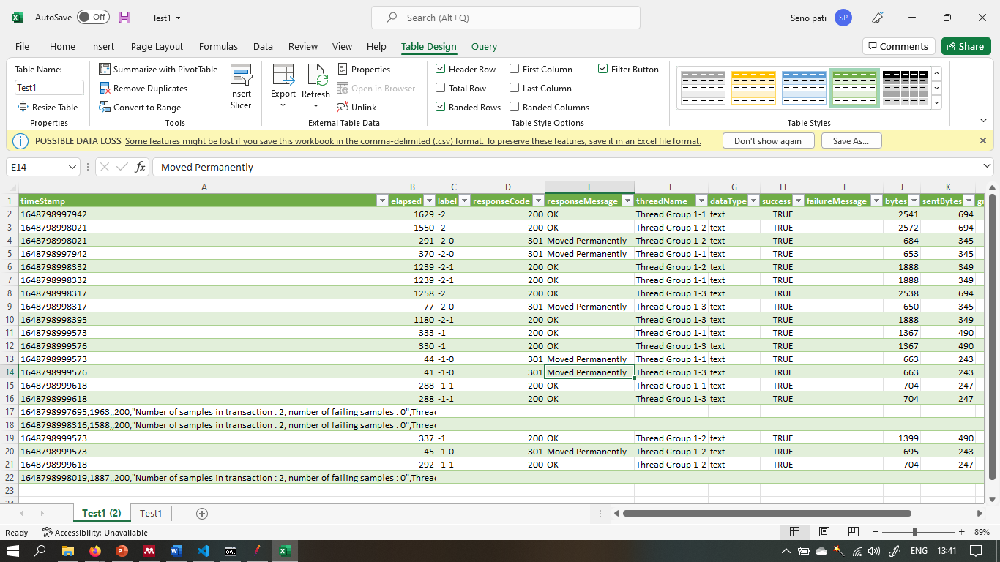

# Section 22 Introduction JMeter and Tutorial Record with JMeter

Pada materi ini mempelajari :

1. Why JMeter?
2. Pros of JMeter
3. Install tools
4. Open JMeter
5. Install Plugin
6. Some components of JMeter script

## JMeter

APACHE Apache JMeter adalah perangkat lunak sumber terbuka, aplikasi desktop Java 100% murni . Yang dirancang untuk memuat uji perilaku fungsional dan mengukur kinerja situs web. Awalnya dirancang untuk aplikasi web pengujian beban tetapi sejak itu diperluas ke fungsi pengujian lainnya.

## Pros of JMeter

- Open Source
- Easy to use with GUI / Non GUI

## Install tools

- Install JOK (Java Development Kit)
- Search JMeter & Download

## Open S

- Open terminal
- Navigate to the bin folder
- Run JMeter

## Install Plugin

Plugins are software add-ons installed on
a program, to tun additional features in an
application or program
https://jmeter-plugins.org/install/Install/

> Open directory JMeter

Open directory JMeter and navigate to
lib/ext directory

> Move file jar

Move fie plugin-managerjar into
lib/ext in JMeter directory

## Some components of JMeter script

> Test Plan
> Rencana besar tes yang akan dilakukan (parent)
> Thread Groups
> Kumpulan thread yang menjolankan skenorio yong sarna
> Somplers
> Sebutan untuk request yong dikrim ke server
> Contig elements
> Elemen yang digunokan untuk konfiguras! atau modifkasi sampler requests yang dikrim ke server
> isteners
> Perekam data yang dihasilken dari tes
> Timers
> Fitur ini akon jon duluon sebelum semua ftur yang lain berjalan
> Assertions
> Seperti assert pada APY Web/Testing, merupakan krteria tambahan apakah pasti/tidak
> Pre-post processors
> Fitur yang memproses response data sebelum/sesudah tes

# Task

