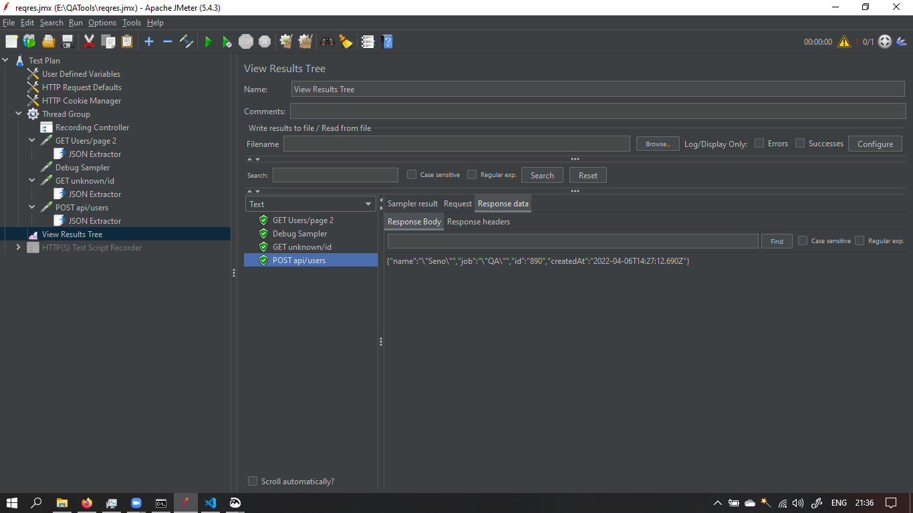

# Section 23 Post Processor

## WHAT IS POST PROCESSOR ?

Post-Processors are actions that are performed after your sampler has been executed. You can use them to perform some actions on your response or extract some values out from the response and save them in a variable that can be used later

# TASK

