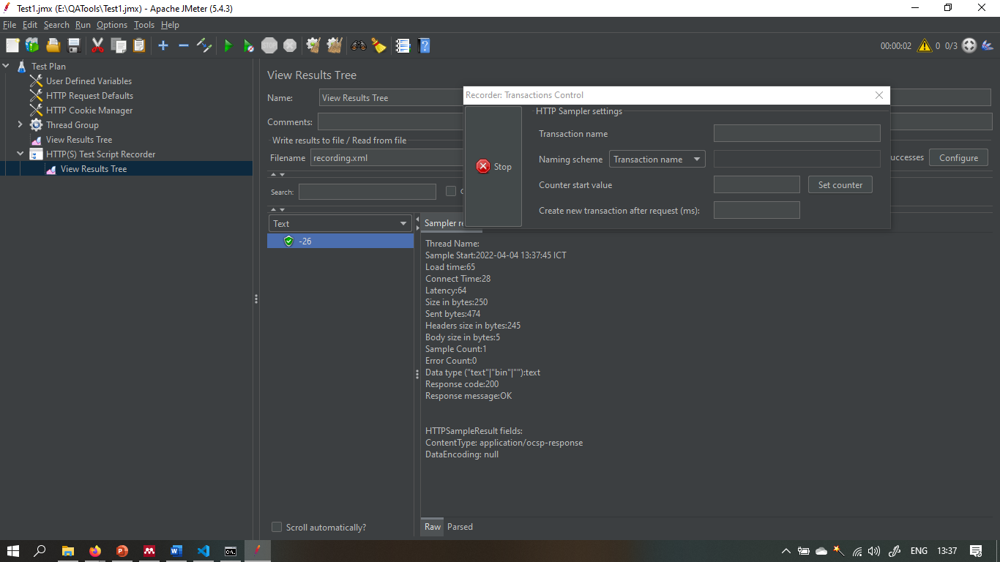

# Section 24 Understanding Jmeter Results

## Understanding Jmeter Results

Laporan ringkasan menciptakan baris tabel untuk setiap permintaan bernama berbeda dalam pengujian Anda. Ini mirip dengan laporan agregat, kecuali bahwa ia menggunakan lebih sedikit memori. Meski crosput dihitung dari sudut pandang target sampler (mis. Server jarak jauh dalam kasus sampel HTTP). JMeter memperhitungkan total waktu di mana permintaan telah dihasilkan. Jika sampler dan timer lain berada di utas yang sama, ini akan meningkatkan total waktu, dan karenanya mengurangi nilai throughput. Jadi dua sampler identik dengan nama yang berbeda akan memiliki setengah throughput dari dua sampler dengan nama yang sama. Penting untuk memilih label sampler dengan benar untuk mendapatkan hasil terbaik dari laporan.

 
- Label - label sampel. Jika "termasuk nama grup di label?" dipilih, maka nama grup utas ditambahkan sebagai awalan. Ini memungkinkan label yang identik dari berbagai kelompok utas yang akan dikumpulkan secara terpisah jika diperlukan.
- Sampel - jumlah sampel dengan label yang sama
- Rata-rata - Rata-rata waktu yang telah berlalu serangkaian
- Min - waktu terendah yang berlalu untuk sampel dengan label yang sama
- Max - waktu yang berlalu terpanjang untuk sampel dengan label yang sama
- STD. Dev. - standar deviasi sampel waktu yang telah berlalu
- Kesalahan% - Persen permintaan dengan kesalahan
- Throughput - throughput diukur dalam permintaan per detik / menit / jam. Unit waktu dipilih sehingga tingkat yang ditampilkan setidaknya 1.0. Ketika throughput disimpan ke file CSV, itu dinyatakan dalam permintaan / detik, I.E. 30.0 Permintaan / menit disimpan sebagai 0,5.
- KB / detik - throughput diukur dalam kilobyte per detik
- AVG. Bytes - Ukuran rata-rata respons sampel dalam byte. (Dalam JMeter 2.2 salah menunjukkan nilai di KB)

# TASK

