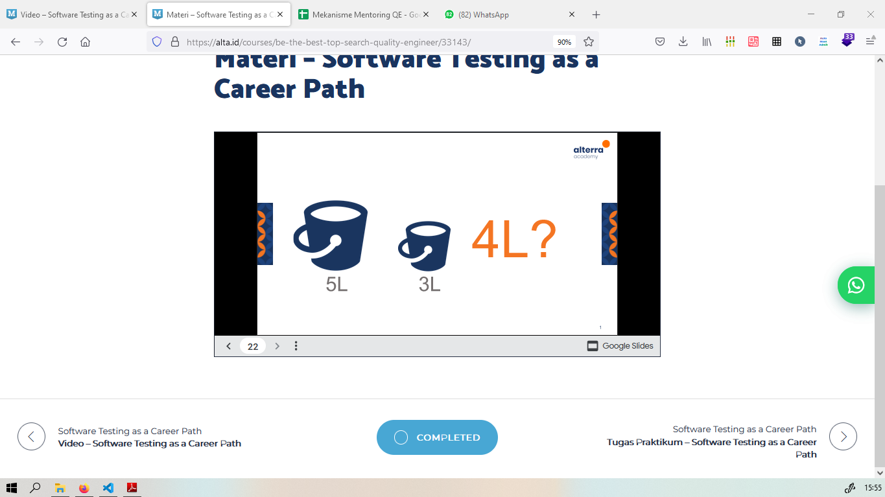

# Section 3 **Software Testing as a Career Path**

## Resume

Dalam section 3 mempelajari:

<ul>
    <li>Pengertian Software Testing</li>
    <li>Jobdesk Software Tester</li>
    <li>Skill yang dibutuhkan Software tester</li>
    <li>Jenjang karir Software Tester </li>
    <li>Alternatif Karir</li>
    <li>Cara menjadi Software Tester</li>
</ul>

 

### **Software Testing**

> Proses verifikasi sistem / program komputer untuk menentukan apakah memenuhi persyaratan yang telah ditentukan serta menghasilkan hasil sesuai keinginan

Untuk mencapai hasil sesuai keinginan, kita harus melakukan identifikasi masalah/bug pada software.

Jika software tersebut tidak ada masalah, maka software siap dirilis. Namun jika terdapat bug, maka developer akan memperbaiki dan software tester akan melakukan pengujian lagi

 

### **Jobdesk Software Tester**

Adapun yang dilakukan software tester adalah :

1. Memahami dokumen requirement
2. Membuat testcase
3. Mengeksekusi testcase yang telah dibuat
4. Melaporkan dan menguji kembali bug
5. Meeting bersama stakeholder maupun developer

 

### **Skill yang dibutuhkan Software tester**

Skill yang harus dimiliki software tester :

**Non Technical**

1. <i>Analytical Skill</i>
     Memiliki skill analisis yang baik sangat penting dimiliki untuk membantu/memudahkan memecah software yang kompleks menjadi lebih sederhana
2. <i>Communication Skill</i>
     Memiliki skill komunikasi yang baik dibutuhkan karena kita akan berkomunikasi dengan tim produk dan tim developer
3. <i>Time Management & Organization skill</i>
     Time menagement dan organization skill dibutuhkan karena kita akan bekerja secara tim / bersama orang lain
4. <i>Great Attitude</i>
     Sikap yang baik sangat dibutuhkan karena seiring majunya industri teknologi dengan memiliki sikap yang baik, maka akan menunjang technical skill yang akan diterapkan di dunia industri
5. <i>Passion</i>
     Apakah kita nyaman/minat dalam software testing. Jika belum pernah melakukan testing sebelumnya, bisa melakukan testing sederhana untuk mengukur minat/kenyamanan sebagai software tester

**Technical Skill**

1. Memahami dasar commands Linux/Unix
     Berguna sebagai automation dimana pemahaman tersebut digunakan untuk proses instalasi dan menggunakan beberapa software
2. Memahami dan memiliki pengalaman menggunakan test management tools
     Digunakan untuk menyimpan informasi pengujian produk dilakukan, perencanaan kegiatan serta dokumen status kegiatan.
   Contoh : Testlink, PractiTest, TestRail
3. Memahami dan memiliki pengalaman menggunakan tracking management tools
     Software yang digunakan untuk mengelola/development software agar efektif. Management dalam tracking adalah serangkaian aktifitas termasuk plan, eksekusi, kontrol dan tahap penyelesaian project. Contoh : JIRA
4. Memahami dan memiliki pengalaman menggunakan Automation testing tools
     Untuk pemilihan tools sangat penting karena untuk emnentukan kesuksesan testing. Contoh : Katalon, Karate, Selenium, Codecaption dll

### **Jenjang karir Software Tester**

1. Junior QE (Freshgraduate)
2. Quality Engineer (1-2 Tahun pengalaman)
3. Senio QE (>3 Tahun pengalaman)
4. QE Lead(5-6 Tahun pengalaman)
5. QE Manager (8-11 Tahun pengalaman)

### **Alternatif Karir**

1. Peformance Tester
2. Penetration Tester
3. System Analyst
4. Scrum Master

### **Cara menjadi Software Tester**

1. Mempelajari Software Testing
2. Mempelajari Test case Management Tools
3. Mempelajari dan melakukan automation testing
4. Melamar pekerjaan

   

# Task Praktikum

Untuk mendapatkan 4L dari Ember berukuran 5L dan 3L

Langkah :

1. Diisikan penuh pada ember 5L
2. Tuang **ember 5L** kedalam **ember 3L** sebanyak **3L air** (Sekarang **ember 5L berisikan 2L** dan **ember 3L berisikan penuh 3L** )
3. Buang **ember 3L Seluruhnya** (Sekarang **ember 5L berisikan 2L** dan **ember 3L berisikan 0L**)
4. Tuang **ember 5L** kedalam **ember 3L** (Sekarang **ember 5L berisikan 0L** dan **ember 3L berisikan 2L**)
5. isikan **penuh ember 5L** (Sekarang **ember 5L berisikan 5L** dan **ember 3L berisikan 2L**)
6. **Penuhi ember 3L** dari **ember 5L** (Sekarang **ember 5L berisikan 4L** dan ember **3L berisikan penuh 3L**)

**_Didapatkan sekarang Ember 5L berisi 4L dan Ember 3L berisi penuh 3L_**
