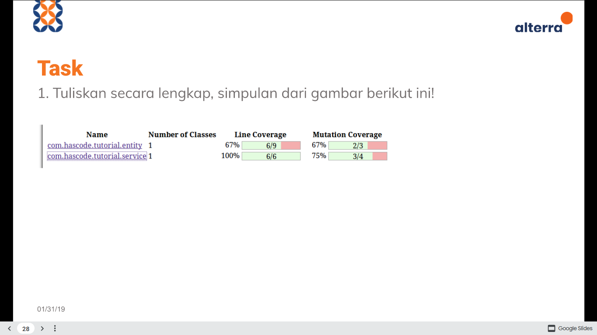
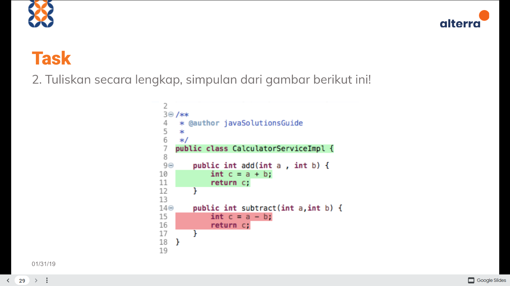
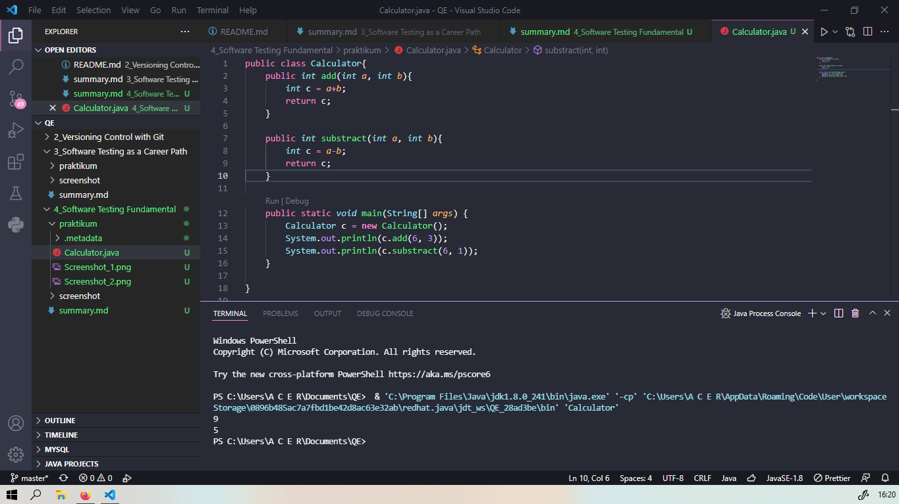

# Section 4 **Software Testing Fundamental**

## Resume

Dalam section 4 mempelajari:

<ul>
    <li>Pengertian Software Testing</li>
    <li>Pentingnya Software Testing</li>
    <li>Testing Platform</li>
    <li>Tipe Software Testing</li>
    <li>Level testing</li>
</ul>

 

### **Software Testing**

> Proses analisis sebuah item software untuk mendeteksi perbedaan antara kondisi saat ini dan kondisi yang diperlukan dan mengevaluasi fitur dari item software

 

### **Pentingnya Software Testing**

Dengan adanya software testing kita dapat menghemat biaya, menjaga kualitas produk, keamanan dan kepuasan pelanggan

Software yang terdapat bug sangat berbahaya, seingga dapat menyebabkan potensi krisis moneter dan manusia

 

### **Testing Platform**

<li>API (Application Programming Interface) </li>
<li>WEB</li>
<li>Mobile</li>
<li>Desktop</li>

 

### **Jenis software testing**

<li>Functional Testing</li>
Pengujian fungsi aplikasi untuk memastikan sudah sesuai requirment specification 
Contoh: Manual (Software Tester menjalankan testcase), Automate (Menulis code/test script untuk automation tes, dan Testing dijalankan melalui sebuah software), etc
<li>Non Functional Testing</li>
Pengujian aspek non functional seperti keamanan, performance testing(Speed, Scalability, Stability) dll
<li>Maintenance Testing</li>
Diperlukan untuk mempertahankan karakteristik suatu software. Contoh: Regression

 

### **Level testing**

1. Unit Testing 
   Level testing untuk menguji suatu unit atau komponen dari sebuah software
2. Integration Testing  
   Pengujian dari penggabungan unit unit yang ada. Unit unit tersebut dites bagaimana mereka bekerja sebagai kombinasi bukan secara individual. Dilakukan secara bertahap untuk menelusuri bug.
3. System Testing 
   Testing pada keseluruhan system untuk memastikan seluruh skenario sudah berjalan dengan baik , apakah memenuhi persyaratan untuk digunakan oleh pengguna
4. Acceptance Testing 
   Tahap akhir untuk testing, pada level ini apakah system yang didevelop sudah memenuhi seluruh kebutuhan pengguna atau proses bisnis yang dibutuhkan

# Task Praktikum

## Task 1

> Code coverage adalah salah satu alat ukur utama dalam proses testing sebuah software yang mengukur seberapa banyak sebuah code yang telah dibuat sudah dilakukan proses testing. Code coverage juga dijadikan standart untuk mengukur kualitas dari sebuah software.Semakin tinggi code coverage dari software kita, maka menunjukkan proses testing yang kita lakukan telah menyeluruh sehingga klien akan menilai bahwa software kita telah di-develope dan di-maintain secara baik serta dapat dipastikan performa software kita akan bagus.

 

Code coverage pada **com.hascode.tutorial.entity** didapatkan hasil line coverage 67% yang artinya sudah mengevaluasi sebanyak baris kode 67% dan mutation coverage 67% yang artinya sudah dilakukan pengujian untuk meningkatakan kecukupan tes dan mengindentifikasi cacat kode sebanyak 67%

Code coverage pada **com.hascode.tutorial.service** didapatkan hasil line coverage 100% yang artinya sudah mengevaluasi sebanyak baris kode 100% dan mutation coverage 75% yang artinya sudah dilakukan pengujian untuk meningkatakan kecukupan tes dan mengindentifikasi cacat kode sebanyak 75%

 

## Task 2

Pada method add dan subtract terdapat parameter int a, dan int b

jika variabel a dan b diisi berupa angka, misalnya

<li>Pada method add variabel a = 6 dan b = 3</li>
maka jika method tersebut dijalankan menghasilkan nilai return sesuai dengan penjumlahan yang diharapkan yaitu c = a + b  atau 6 + 3 = 9

<li>Pada method subtract variabel a = 6 dan b = 1</li>
maka jika metrhod tersebut dijalankan menghasilkan nilai return yang sesuai pengurangan yang diharapkan yaitu c = a - b  atau 6 + 1 = 5

**Kesimpulannya** : Code diatas sudah berjalan sesuai apa yang diharapkan (Menghasilkan output sesuai method yang diinginkan)
