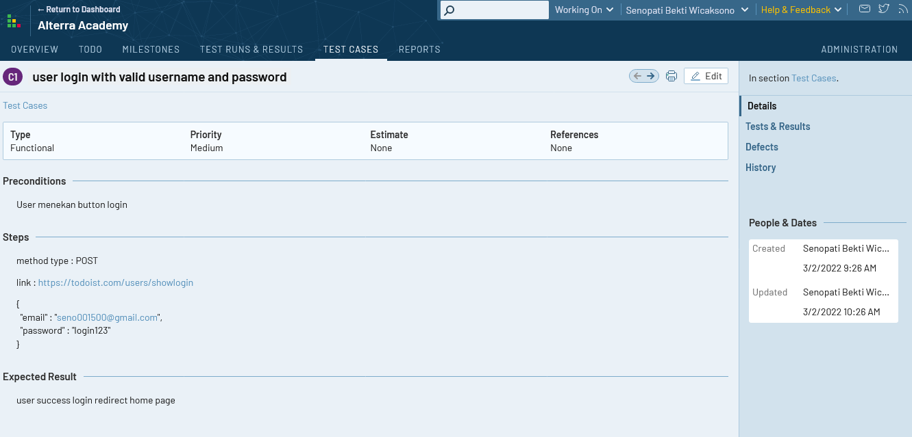
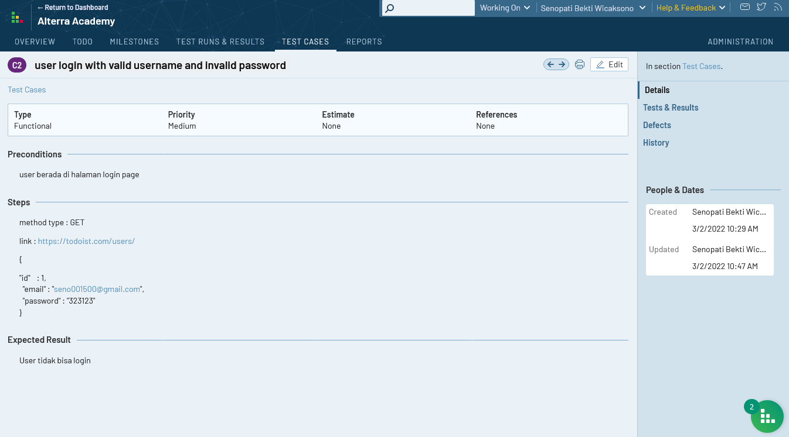
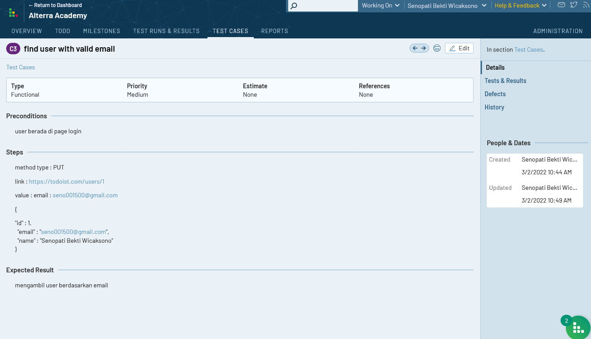
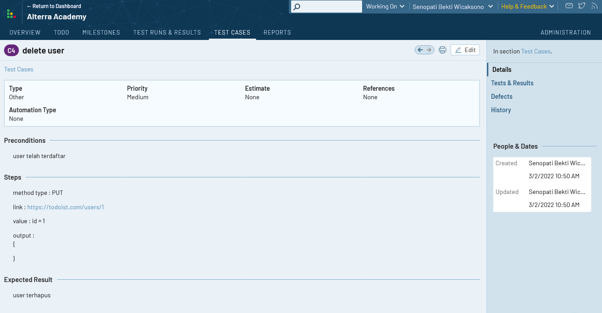
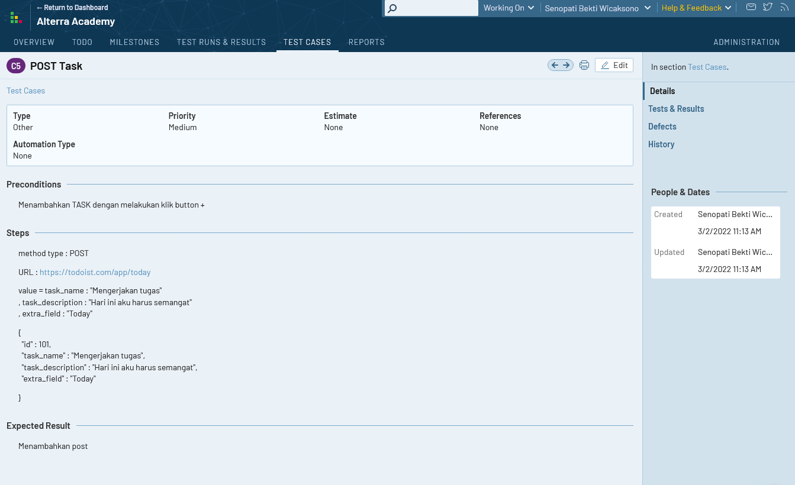
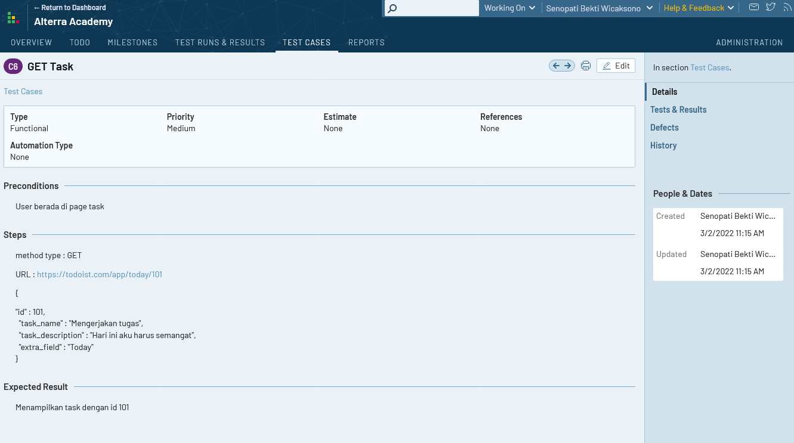
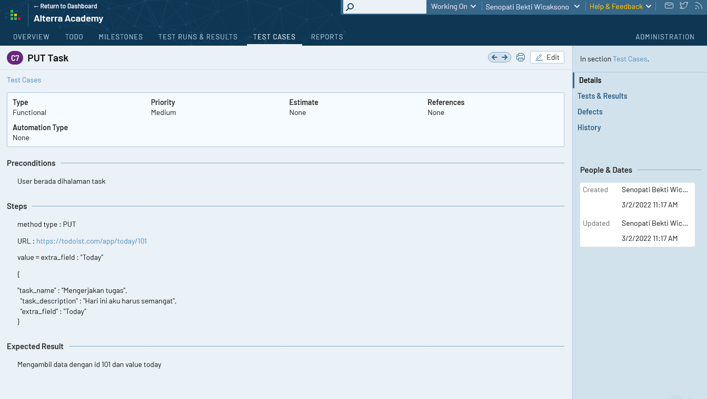
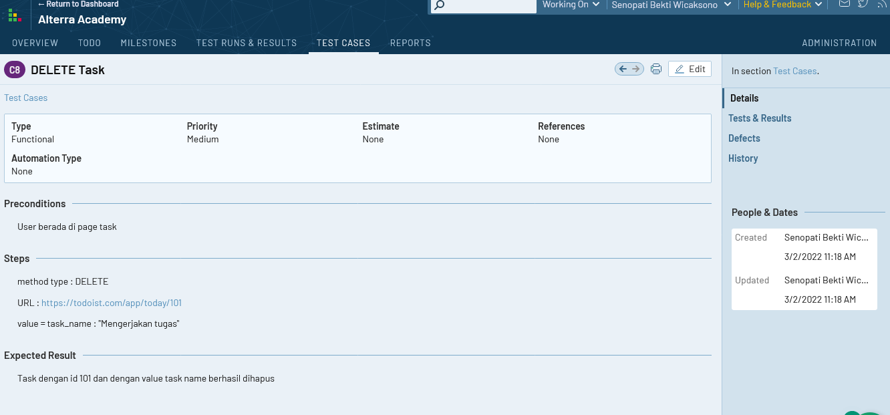

# Section 7 **Test Case Management Tools**

## Resume

> Test case management adalah sebuah software yang digunakan oleh software tester untuk menyimpan informasi bagaimana pengujian produk harus dilakukan, perencanaan kegiatan pengujian dan dokumen pelaporan status kegiatan penjaminan produk

Manfaat test case management tools :

1. Plan and Estimate  
   Berisi fitur apa saja yang dites saat itu, fitur apa saja yang sudah dites, hal apa saja yang berhubungan dengan tes tersebut, berapa banyak sumber daya yang dibutuhkan dari jadwal yang ditentukan.   Setelah memahami detail project maka selanjutnya bisa menentukan estimasi untuk project
2. Monitoring and Controlling  
   Kita dapat memonitoring connecting, recording dan reporting. Dapat mengontrol data data yang dibuat pada suatu tempat
3. Reporting and Integrate with another tools  
   Dengan test case management tools, kita tidak perlu repot repot membuat report secara manual. Dan test case management tools dapat di integrasikan dengan tools jira dll

 

Macam macam Test Case Management Tools:

<ul>
    <li>TestRail</li>
    <li>TestLink</li>
    <li>Zephyer</li>
    <li>qTest</li>
    <li>PractiTest</li>
</ul>

 

### **Langkah langkah test case management**

Test Rail :

1. Create test project
2. Create milestones
3. Create test plan
4. Create test runs
5. Create test case and add test run
6. Execute test case
7. Generate Report

  

# TASK

Resource Login
URL : https://todoist.com/users/showlogin

1. POST
   
2. GET
   
3. PUT
   
4. DELETE
   

Resource Task
URL : https://todoist.com/app/today

1. POST
   
2. GET
   
3. PUT
   
4. DELETE
   
