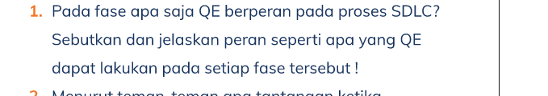
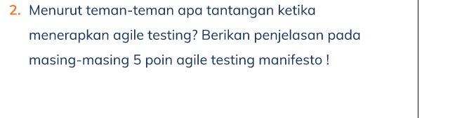

# Section 8 **Agile Testing**

## Resume

Dalam section 4 mempelajari:

<ul>
    <li>Pengertian SDLC</li>
    <li>Fase SDLC</li>
    <li>Agile Testing Manifesto</li>
    <li>Piramida Testing</li>
</ul>

 

### **SDLC - Software Development Life Cycle**

> Proses yang digunakan untuk merancang, mengembangkan dan menguji software

Tujuannya :

> Untuk menyediakan alur terstruktur dalam membantu organisasi dalam membuat software berkualitas dengan perkiraan waktu yang singkat dan biaya yang rendah
>  

### **Fase SDLC**

1. Requirements Gathering
2. Design
3. Development (Code)
4. Testing
5. Deployment
6. Maintenance

 

### **Model SDLC**

1. WATERFALL Model
2. AGILE Model
3. ITERATIVE Model
4. V-Shaped Model
5. Big bang Model
6. Spiral Model

 

### **Agile Testing Manifesto**

5 Kunci testing manifesto :

1. Testing is an activity not a phase
2. Prevent bugs rather than finding bugs
3. Dont be a checker, be a tester
4. Dont try to break the system, instead help build the best possible system
5. The whole team is responsible for quality, not just the tester

 

### **Testing Pyramid**

Level piramida :

1. Unit Test
2. Integration/Service
3. UI

# Task Praktikum

## Task 1

Pada fase **testing** QE berperan pada proses SDLC.  
Proses yang dilakukan seorang QE Pada tahap tersebut adalah menulis / membuat test case dan mengeksekusi dari test case yang telah dibuat
 

 

## Task 2

Tantangannya adalah tingkat kolaborasi sulit untuk dipertahankan

Proyek pengembangan perangkat lunak dengan metode agile membagi seluruh masalah menjadi beberapa solusi. Jadi, kenario khas untuk proyek besar agile yang terdiri dari beberapa tim scrum. Tim-tim ini tidak hanya bergantung satu sama lain tetapi juga bekerja secara bersama. Oleh karena itu, koordinasi di antara tim adalah masalah yang berkaitan untuk menghindari kesenjangan dalam metodologi agile. Hal ini pada akhirnya dapat menyebabkan kegagalan proyek atau scope creep.

Orang melihat pengujian sebagai fase yang terjadi pada akhir perkembangan. Sebaliknya, dalam tangkas, pengujian bukanlah fase tetapi aktivitas yang perlu terjadi, bersama dengan pengkodean, dokumentasi, dan yang lainnya

Jika papan tugas memiliki kolom terpisah untuk pengujian, itu adalah tanda pasti bahwa pengujian masih dianggap sebagai fase, dan aktivitas penguji masih terpisah dari pekerjaan tim yang tersisa.
