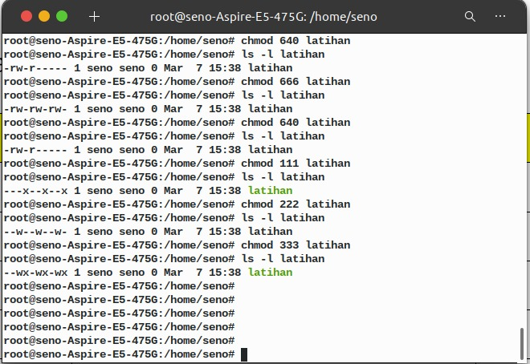

# Section 9 **9_Linux Basic Command**

## Resume

Dalam section 9 mempelajari:

<ul>
    <li>Linux Commands Structure</li>
    <li>Basic commands</li>
    <li>File System Commands</li>
    <li>Processes Control Commands</li>
    <li>Utilities Programs Commands</li>
    <li>File Access Permissions</li>
</ul>

### Linux Commands Structure

> Command [options] [parametes]

### Basic commands

> cal , date , etc

### File System Commands

> touch, cat, cp, mv, rm, mkdir, rmdir, cd, pwd

### Processes Control Commands

> top, clear, history, etc.

### Utilities Programs Commands

> ls, which, sudo, find, etc.

### File Access Permissions

> chmmod, chowm, etc.

 

 

## Task

Command linux :

Penjelasan hak akses :
 

Melakukan update :
 

Melakukan upgrade :
 

Membuat direktori :
 

Membuat direktori dan copy file:
 

Menghapus file:
 

